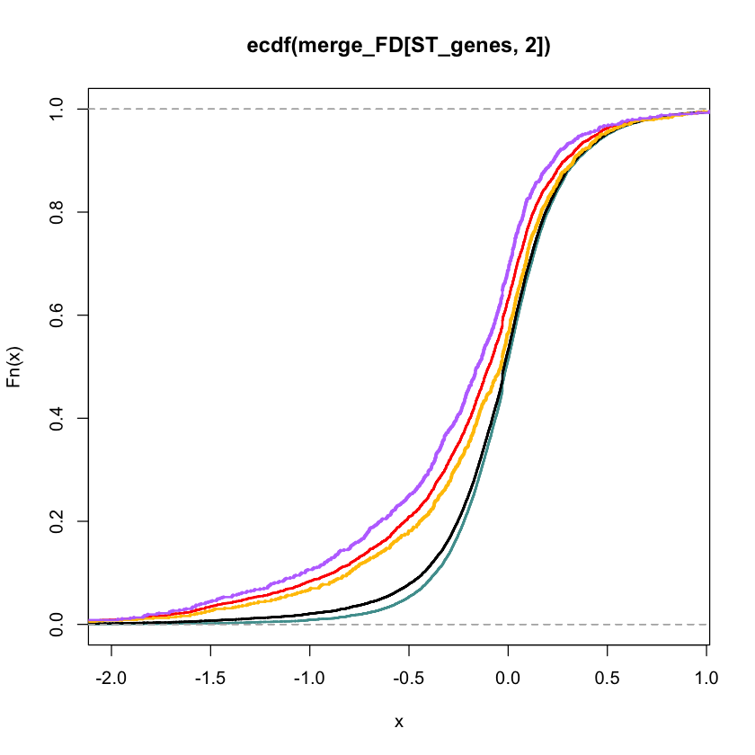
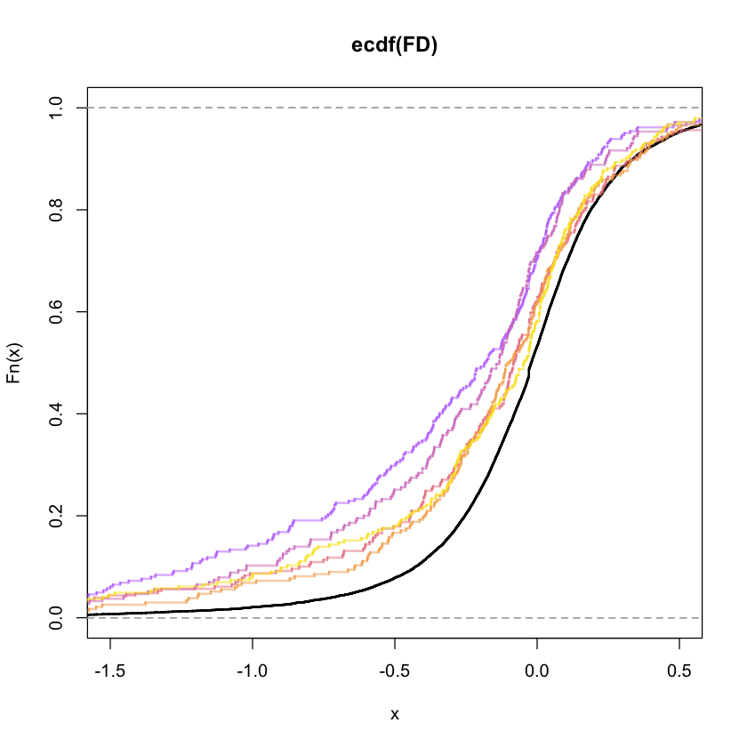
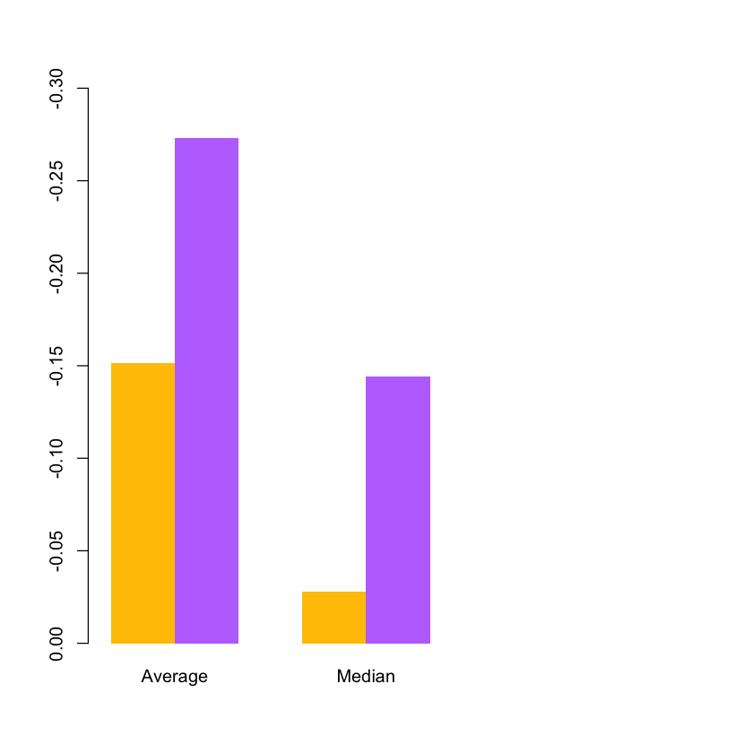
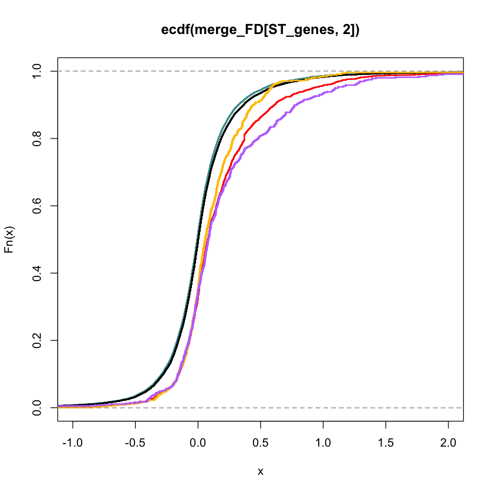
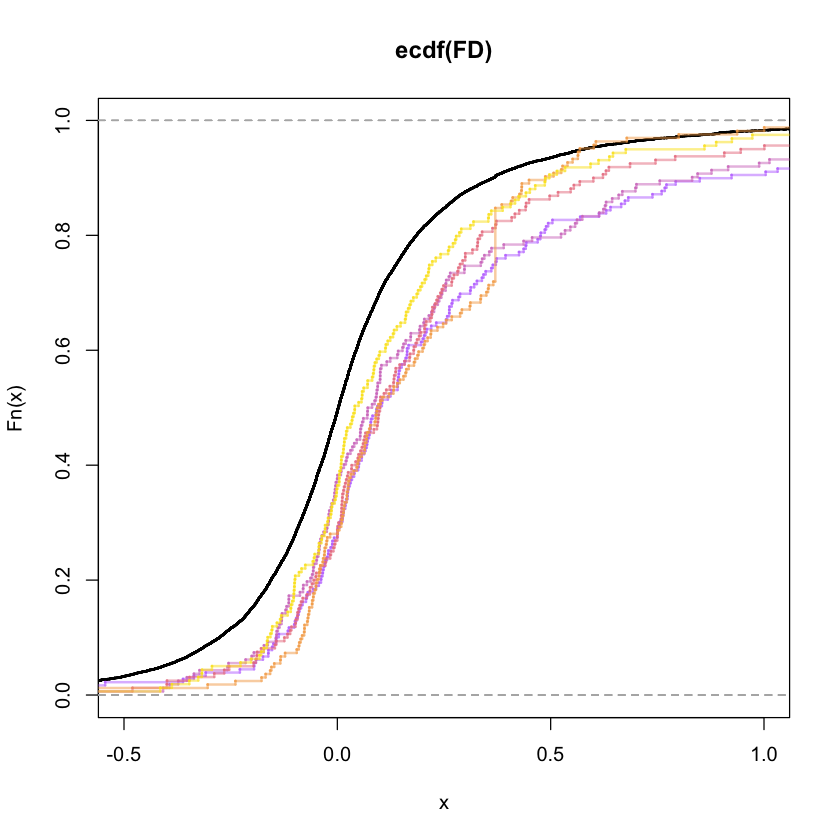
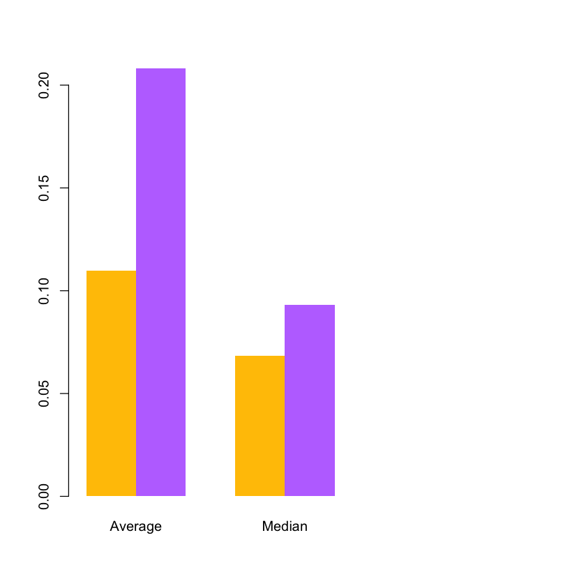
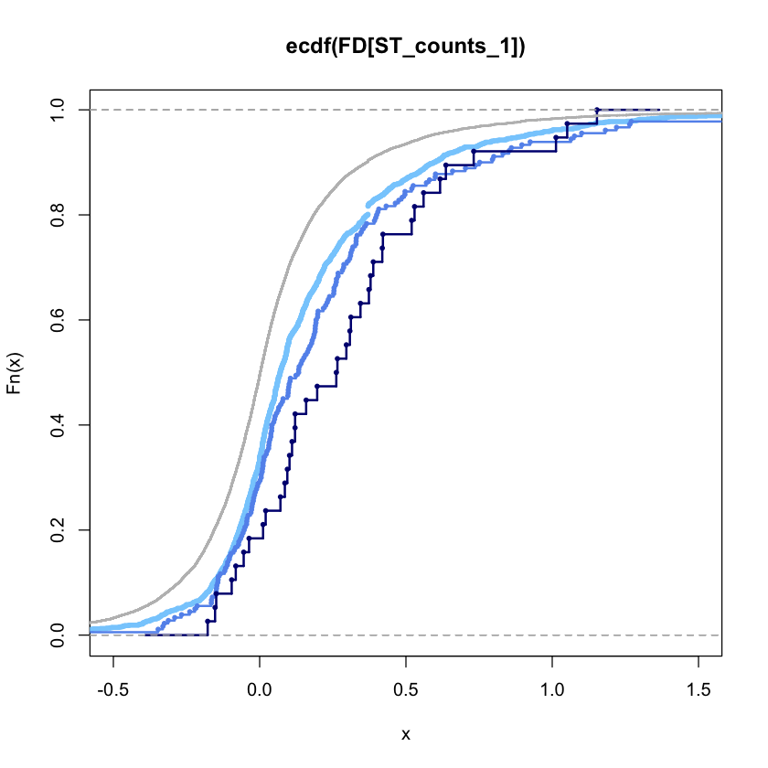

```R
read.table("/Users/James/Desktop/ss/yale_project/mirna/miRTarget/mir124_OV.txt",header=T,row.names=1)-> FD   #load expression data

 # processing expression and convert format
FD[FD=="-"]<-"NA"
na.omit(FD)->FD
as.numeric(t(FD))->FD2
rownames(FD)->names(FD2)
FD2->FD


```

    Warning message in `[<-.factor`(`*tmp*`, thisvar, value = "NA"):
    “invalid factor level, NA generated”


```R

 # load binding sites
read.delim("/Users/James/Desktop/ss/yale_project/mirna/New_data/miR-124/hsa-miR-124-3p-seed_3pUTR.txt",header=F,sep="\t")->miR_strong_sites
as.vector(unique(miR_strong_sites[which(miR_strong_sites[,"V7"]%in%c("7mer-m8","7mer-A1","8mer")),"V1"])) -> ST_genes #pick strong seed sites
as.vector(unique(miR_strong_sites[which(miR_strong_sites[,"V7"]%in%c("7mer-m8","7mer-A1","8mer","offset-6mer","6mer")),"V1"])) -> seed_genes #pick strong seed sites


setdiff(names(FD),ST_genes)->wk_genes    #define weak genes
setdiff(names(FD),seed_genes)->nonseed_genes    #define weak genes

#load weak sites
read.delim("/Users/James/Desktop/ss/yale_project/mirna/New_data/miR-124/hsa-miR-124-3p-seedless_3pUTR.txt",header=F,sep="\t")->miR_weak_sites
miR_weak_sites[which(miR_weak_sites[,"V7"]=="other"),1]->miR_weak_sites2
as.matrix(table(miR_weak_sites2))->miR_weak_counts
colnames(miR_weak_counts)<-"tmp"
merge(as.matrix(ST_genes),miR_weak_counts,by.x=1,by.y=0,all.x=T)->Strong_WScounts
Strong_WScounts[is.na(Strong_WScounts)]=0


##Weak sites and expression on strong genes
merge(as.matrix(FD),Strong_WScounts,by.x=0,by.y=1)->merge_FD
rownames(merge_FD)<-merge_FD[,1]
quantile(merge_FD[,3],c(1/3,2/3))->quan
rownames(merge_FD)[which(merge_FD[,3]<=quan[1])]->few_genes
rownames(merge_FD)[which(merge_FD[,3]>quan[2])]->more_genes


```


```R

###plot of genes
plot(ecdf(merge_FD[ST_genes,2]),col="red",xlim=c(-2,0.9),lwd=2,cex=0.5,verticals=T)
lines(ecdf(FD[wk_genes]),col="#4F9D9D",lwd=2,cex=0.5,verticals=T)
lines(ecdf(FD),col="black",lwd=2,cex=0.5,verticals=T)

lines(ecdf(merge_FD[more_genes,2]),col="#FFC300",lwd=2,cex=0.3,verticals=T)
lines(ecdf(merge_FD[few_genes,2]),col="#BE77FF",lwd=2,cex=0.3,verticals=T)
colorRampPalette(c("#BE77FF","#F08080","yellow"))(10)->cols_tmp
paste(cols_tmp,"80",sep="")->cols
quantile(merge_FD[,3],seq(0.1,0.9,0.1))->quan
rownames(merge_FD)[which(merge_FD[,3]<=quan[1])]->genes_q1
rownames(merge_FD)[which(merge_FD[,3]>quan[1] & merge_FD[,3]<=quan[2] )]->genes_q2
rownames(merge_FD)[which(merge_FD[,3]>quan[2] & merge_FD[,3]<=quan[3] )]->genes_q3
rownames(merge_FD)[which(merge_FD[,3]>quan[3] & merge_FD[,3]<=quan[4] )]->genes_q4
rownames(merge_FD)[which(merge_FD[,3]>quan[4] & merge_FD[,3]<=quan[5] )]->genes_q5
rownames(merge_FD)[which(merge_FD[,3]>quan[5] & merge_FD[,3]<=quan[6] )]->genes_q6
rownames(merge_FD)[which(merge_FD[,3]>quan[6] & merge_FD[,3]<=quan[7] )]->genes_q7
rownames(merge_FD)[which(merge_FD[,3]>quan[7] & merge_FD[,3]<=quan[8] )]->genes_q8
rownames(merge_FD)[which(merge_FD[,3]>quan[8] & merge_FD[,3]<=quan[9] )]->genes_q9
rownames(merge_FD)[which(merge_FD[,3]>quan[9]  )]->genes_q10


```


    

    


```R

k=2; n=0.2
plot(ecdf(FD),col="black",xlim=c(-1.5,0.5),lwd=k,cex=n,verticals=T)
lines(ecdf(FD[genes_q1]),col=cols[1],lwd=k,cex=n,verticals=T)
#lines(ecdf(FD[genes_q2]),col=cols[2],lwd=k,cex=n,verticals=T)
lines(ecdf(FD[genes_q3]),col=cols[3],lwd=k,cex=n,verticals=T)
#lines(ecdf(FD[genes_q4]),col=cols[4],lwd=k,cex=n,verticals=T)
lines(ecdf(FD[genes_q5]),col=cols[5],lwd=k,cex=n,verticals=T)
#lines(ecdf(FD[genes_q6]),col=cols[6],lwd=k,cex=n,verticals=T)
lines(ecdf(FD[genes_q7]),col=cols[7],lwd=k,cex=n,verticals=T)
#lines(ecdf(FD[genes_q8]),col=cols[8],lwd=k,cex=n,verticals=T)
lines(ecdf(FD[genes_q9]),col=cols[9],lwd=k,cex=n,verticals=T)
#lines(ecdf(FD[genes_q10]),col=cols[10],lwd=k,cex=n,verticals=T)


```


    

    


```R


#######Figure 1d
#more WS targets
mean(merge_FD[more_genes,2])-mean(FD[nonseed_genes])->mean_diff_more
median(merge_FD[more_genes,2])-median(FD[nonseed_genes])->median_diff_more

#fewer WS targets
mean(merge_FD[few_genes,2])-mean(FD[nonseed_genes])->mean_diff_few
median(merge_FD[few_genes,2])-median(FD[nonseed_genes])->median_diff_few

#barplots
rbind(c(mean_diff_more,median_diff_more),c(mean_diff_few,median_diff_few))->bars_miR
rownames(bars_miR)<-c("more","fewer")
colnames(bars_miR)<-c("Average","Median")
barplot(bars_miR,beside=T,col=c("#FFC300","#BE77FF"),width=0.1,xlim=c(0.1,1),border=F,ylim=c(0,-.3))

#######Figure S1a
rownames(merge_FD)[which(merge_FD[,3]<=quan[2] & merge_FD[,3]>quan[1])]->mid_genes

plot(ecdf(FD),col="black",lwd=2,cex=0.5,verticals=T,xlim=c(-2,1))

lines(ecdf(merge_FD[more_genes,2]),col="#FFC300",lwd=2,cex=0.3,verticals=T)
lines(ecdf(merge_FD[few_genes,2]),col="#BE77FF",lwd=2,cex=0.3,verticals=T)
lines(ecdf(merge_FD[mid_genes,2]),col="#F08080",lwd=2,cex=0.3,verticals=T)

#####Figure S1c      cor Strong vs Weak counts
as.matrix(table(miR_strong_sites[which(miR_strong_sites[,"V7"]%in%c("7mer-m8","7mer-A1","8mer")),"V1"])) -> ST_counts_tmp #pick strong seed sites
ST_counts_tmp[which(ST_counts_tmp>0),]->ST_counts

boxplot(merge_FD[which(ST_counts[merge_FD[,1]]==1),3],merge_FD[which(ST_counts[merge_FD[,1]]==2),3],merge_FD[which(ST_counts[merge_FD[,1]]>2),3],ylim=c(0,250),col=c("#5CADAD","#8080C0","#AE57A4"),outline=F,width=c(0.5,0.5,0.5),boxwex=0.5)


```


    

    


    

    


    

    


```R

######ST counts and FD
as.vector(miR_strong_sites[which(miR_strong_sites[,"V7"]%in%c("7mer-m8","7mer-A1","8mer")),"V1"]) -> ST_counts_genes #pick strong seed sites
table(ST_counts_genes)->ST_counts
names(which(ST_counts==1))->ST_counts_1
names(which(ST_counts==2))->ST_counts_2
names(which(ST_counts>2))->ST_counts_more


plot(ecdf(FD[ST_counts_1]),cex=2,col="#FFC0Cb",lwd=4.5)
lines(ecdf(FD[ST_counts_2]),cex=0.5,col="#FF69B4",lwd=2)
lines(ecdf(FD[ST_counts_more]),cex=0.5,col="#DC143C",lwd=2)
lines(ecdf(FD[]),cex=0.5,col="grey",lwd=2)

length(na.omit(FD[ST_counts_1]))
length(na.omit(FD[ST_counts_2]))
length(na.omit(FD[ST_counts_more]))
length(na.omit(FD))

```


1973


361


92


15119


    

    


```R

as.vector(unique(miR_strong_sites[which(miR_strong_sites[,"V7"]%in%c("7mer-m8")),"V1"])) -> X7mer.m8
as.vector(unique(miR_strong_sites[which(miR_strong_sites[,"V7"]%in%c("7mer-A1")),"V1"])) -> X7mer.A1
as.vector(unique(miR_strong_sites[which(miR_strong_sites[,"V7"]%in%c("8mer")),"V1"])) -> X8mer

boxplot(merge_FD[X8mer,3],merge_FD[X7mer.A1,3],merge_FD[X7mer.m8,3],col=c("#FF9966","#FF6666","#FFCCCC"),outline=F)
rbind(cbind(merge_FD[X8mer,3],"A"),cbind(merge_FD[X7mer.A1,3],"B"),cbind(merge_FD[X7mer.m8,3],"C"))->xx

summary(aov(xx[,1]~xx[,2]))

```


                  Df  Sum Sq Mean Sq F value Pr(>F)
    xx[, 2]        2    8466    4233   1.444  0.236
    Residuals   2711 7944610    2931               
    2122 observations deleted due to missingness


    

    


```R

read.delim("/Users/James/Desktop/ss/yale_project/mirna/miRTarget/TargetPredictions/Mouse_Combined_Counts/mmu-miR-122-5p-combinedcounts.txt",header=T,sep="\t",row.names=1)-> mir_targets_122   ####require double check version of miR-122  older version


mir_targets_122[,-dim(mir_targets_122)[2]]-> mir_targets_122_2
colnames(mir_targets_122_2)<-colnames(mir_targets_122)[-1]

rownames(mir_targets_122_2)[which(rowSums(mir_targets_122_2[,c("X8mer","X7mer.A1","X7mer.m8")])>0)]->ST_genes
rownames(mir_targets_122_2)[which(rowSums(mir_targets_122_2[,c("X8mer","X7mer.A1","X7mer.m8","offset.6mer","X6mer")])>0)]->seed_genes


```


```R

####Coding batch 1 Figure 1C; Figure S1b; Figure 1e
##########figure 1b miR_122

#read.delim("/Users/James/Desktop/ss/yale_project/mirna/miRTarget/TargetPredictions/Mouse_Combined_Counts/mmu-miR-122-5p-labeled-counts.txt",header=T,sep="\t",row.names=1)-> mir_targets_122   ####require double check version of miR-122
#####load WS data
read.csv("/Users/James/Desktop/ss/yale_project/mirna/mir_exp/miR-122_array_mouse.csv",header=T,row.names=1)-> EXP   #load expression data
FD<-rowMeans(EXP[,4:7])-rowMeans(EXP[,1:3])
WS<-read.table("/Users/James/Desktop/ss/yale_project/mirna/miRTarget/TargetPredictions/new_details/miR-122-5p-Seedless.txt",header=F)
WS[which(WS[,"V7"]=="other"),1]->WS2
as.matrix(table(WS2))->count_WS
colnames(count_WS)<-"tmp"
merge(as.matrix(ST_genes),count_WS,by.x=1,by.y=0,all.x=T)->Strong_WScounts
Strong_WScounts[is.na(Strong_WScounts)]=0

setdiff(names(FD),ST_genes)->wk_genes    #define weak genes
setdiff(names(FD),seed_genes)->nonseed_genes    #define weak genes


##Weak sites and expression on strong genes
merge(as.matrix(FD),Strong_WScounts,by.x=0,by.y=1)->merge_FD
rownames(merge_FD)<-merge_FD[,1]
quantile(merge_FD[,3],c(1/3,2/3))->quan
rownames(merge_FD)[which(merge_FD[,3]<=quan[1])]->few_genes
rownames(merge_FD)[which(merge_FD[,3]>quan[2])]->more_genes


```


```R

###plot genes
plot(ecdf(merge_FD[ST_genes,2]),col="red",xlim=c(-1,2),lwd=2,cex=0.5,verticals=T)
lines(ecdf(FD[wk_genes]),col="#4F9D9D",lwd=2,cex=0.5,verticals=T)
lines(ecdf(FD),col="black",lwd=2,cex=0.5,verticals=T)

lines(ecdf(merge_FD[more_genes,2]),col="#FFC300",lwd=2,cex=0.3,verticals=T)
lines(ecdf(merge_FD[few_genes,2]),col="#BE77FF",lwd=2,cex=0.3,verticals=T)

ks.test(merge_FD[more_genes,2], merge_FD[few_genes,2],alternative="greater")
ks.test(merge_FD[ST_genes,2],FD,alternative="less")


```


    
    	Two-sample Kolmogorov-Smirnov test
    
    data:  merge_FD[more_genes, 2] and merge_FD[few_genes, 2]
    D^+ = 0.12508, p-value = 0.000191
    alternative hypothesis: the CDF of x lies above that of y


    Warning message in ks.test(merge_FD[ST_genes, 2], FD, alternative = "less"):
    “p-value will be approximate in the presence of ties”


    
    	Two-sample Kolmogorov-Smirnov test
    
    data:  merge_FD[ST_genes, 2] and FD
    D^- = 0.17352, p-value < 2.2e-16
    alternative hypothesis: the CDF of x lies below that of y


    

    


```R

###plot genes
plot(ecdf(merge_FD[ST_genes,2]),col="red",xlim=c(-1,2),lwd=2,cex=0.5,verticals=T)
lines(ecdf(FD[wk_genes]),col="#4F9D9D",lwd=2,cex=0.5,verticals=T)
lines(ecdf(FD),col="black",lwd=2,cex=0.5,verticals=T)

lines(ecdf(merge_FD[more_genes,2]),col="#FFC300",lwd=2,cex=0.3,verticals=T)
lines(ecdf(merge_FD[few_genes,2]),col="#BE77FF",lwd=2,cex=0.3,verticals=T)


#lines(ecdf(merge_FD[more_genes,2]),col="#FFC300",lwd=2,cex=0.3,verticals=T)
#lines(ecdf(merge_FD[few_genes,2]),col="#BE77FF",lwd=2,cex=0.3,verticals=T)
colorRampPalette(c("#BE77FF","#F08080","yellow"))(10)->cols_tmp
paste(cols_tmp,"80",sep="")->cols
quantile(merge_FD[,3],seq(0.1,0.9,0.1))->quan
rownames(merge_FD)[which(merge_FD[,3]<=quan[1])]->genes_q1
#rownames(merge_FD)[which(merge_FD[,3]>quan[1] & merge_FD[,3]<=quan[2] )]->genes_q2
rownames(merge_FD)[which(merge_FD[,3]>quan[2] & merge_FD[,3]<=quan[3] )]->genes_q3
#rownames(merge_FD)[which(merge_FD[,3]>quan[3] & merge_FD[,3]<=quan[4] )]->genes_q4
rownames(merge_FD)[which(merge_FD[,3]>quan[4] & merge_FD[,3]<=quan[5] )]->genes_q5
#rownames(merge_FD)[which(merge_FD[,3]>quan[5] & merge_FD[,3]<=quan[6] )]->genes_q6
rownames(merge_FD)[which(merge_FD[,3]>quan[6] & merge_FD[,3]<=quan[7] )]->genes_q7
#rownames(merge_FD)[which(merge_FD[,3]>quan[7] & merge_FD[,3]<=quan[8] )]->genes_q8
rownames(merge_FD)[which(merge_FD[,3]>quan[8] & merge_FD[,3]<=quan[9] )]->genes_q9
#rownames(merge_FD)[which(merge_FD[,3]>quan[9]  )]->genes_q10

k=2; n=0.2
plot(ecdf(FD),col="black",xlim=c(-.5,1),lwd=k,cex=n,verticals=T)
lines(ecdf(FD[genes_q1]),col=cols[1],lwd=k,cex=n,verticals=T)
#lines(ecdf(FD[genes_q2]),col=cols[2],lwd=k,cex=n,verticals=T)
lines(ecdf(FD[genes_q3]),col=cols[3],lwd=k,cex=n,verticals=T)
#lines(ecdf(FD[genes_q4]),col=cols[4],lwd=k,cex=n,verticals=T)
lines(ecdf(FD[genes_q5]),col=cols[5],lwd=k,cex=n,verticals=T)
#lines(ecdf(FD[genes_q6]),col=cols[6],lwd=k,cex=n,verticals=T)
lines(ecdf(FD[genes_q7]),col=cols[7],lwd=k,cex=n,verticals=T)
#lines(ecdf(FD[genes_q8]),col=cols[8],lwd=k,cex=n,verticals=T)
lines(ecdf(FD[genes_q9]),col=cols[9],lwd=k,cex=n,verticals=T)
#lines(ecdf(FD[genes_q10]),col=cols[10],lwd=k,cex=n,verticals=T)


```


    

    


    

    


```R

#######Figure 1e
#more WS targets
mean(merge_FD[more_genes,2])-mean(FD[nonseed_genes])->mean_diff_more
median(merge_FD[more_genes,2])-median(FD[nonseed_genes])->median_diff_more

#fewer WS targets
mean(merge_FD[few_genes,2])-mean(FD[nonseed_genes])->mean_diff_few
median(merge_FD[few_genes,2])-median(FD[nonseed_genes])->median_diff_few

#barplots
rbind(c(mean_diff_more,median_diff_more),c(mean_diff_few,median_diff_few))->bars_miR
rownames(bars_miR)<-c("more","fewer")
colnames(bars_miR)<-c("Average","Median")
barplot(bars_miR,beside=T,col=c("#FFC300","#BE77FF"),width=0.1,xlim=c(0.1,1),border=F)


```


    

    


```R

rownames(merge_FD)[which(merge_FD[,3]<=quan[2] & merge_FD[,3]>quan[1])]->mid_genes
#####Figure S1d      cor Strong vs Weak counts

rowSums(mir_targets_122_2[which(rowSums(mir_targets_122_2[,c("X8mer","X7mer.A1","X7mer.m8")])>0),c("X8mer","X7mer.A1","X7mer.m8")])->ST_counts
plot(ST_counts[merge_FD[,1]],merge_FD[,3])
boxplot(merge_FD[which(ST_counts[merge_FD[,1]]==1),3],merge_FD[which(ST_counts[merge_FD[,1]]==2),3],merge_FD[which(ST_counts[merge_FD[,1]]>2),3],ylim=c(0,250),col=c("#5CADAD","#8080C0","#AE57A4"),outline=F,width=c(0.5,0.5,0.5),boxwex=0.5)

#####Figure S1d      Strong type vs weak counts
rownames(mir_targets_122_2)[which(mir_targets_122_2[,c("X8mer")]>0)]->X8mer
rownames(mir_targets_122_2)[which(mir_targets_122_2[,c("X7mer.A1")]>0)]->X7mer.A1
rownames(mir_targets_122_2)[which(mir_targets_122_2[,c("X7mer.m8")]>0)]->X7mer.m8

boxplot(merge_FD[X8mer,3],merge_FD[X7mer.A1,3],merge_FD[X7mer.m8,3],col=c("#FF9966","#FF6666","#FFCCCC"),outline=F)
rbind(cbind(merge_FD[X8mer,3],"A"),cbind(merge_FD[X7mer.A1,3],"B"),cbind(merge_FD[X7mer.m8,3],"C"))->xx
summary(aov(xx[,1]~xx[,2]))


```


    

    


    

    


                  Df  Sum Sq Mean Sq F value Pr(>F)  
    xx[, 2]        2   19054    9527   3.459 0.0317 *
    Residuals   1797 4949682    2754                 
    ---
    Signif. codes:  0 ‘***’ 0.001 ‘**’ 0.01 ‘*’ 0.05 ‘.’ 0.1 ‘ ’ 1
    1172 observations deleted due to missingness


    

    


```R

boxplot(merge_FD[X8mer,2],merge_FD[X7mer.A1,2],merge_FD[X7mer.m8,2])

summary(lm(merge_FD[X7mer.A1,2]~merge_FD[X7mer.A1,3]))->lm_type1
summary(lm(merge_FD[X7mer.m8,2]~merge_FD[X7mer.m8,3]))->lm_type2
summary(lm(merge_FD[X8mer,2]~merge_FD[X8mer,3]))->lm_type3
log(coef(lm_type1)[2,4],10)*(-1)->coef_type1
log(coef(lm_type2)[2,4],10)*(-1)->coef_type2
log(coef(lm_type3)[2,4],10)*(-1)->coef_type3

barplot(c(coef_type1,coef_type2,coef_type3),col=c("#00AEAE","#005AB5","#5151A2"),xlim=c(0.1,2),width=0.2,space=1,ylim=c(0,4),border=F)

anova(lm(c(merge_FD[X7mer.A1,3],merge_FD[X7mer.m8,3],merge_FD[X8mer,3])~c(rep("A",length(X7mer.A1)),rep("B",length(X7mer.m8)),rep("C",length(X8mer)))))


#####Figure S1d2      Weak counts vs seed type
rowSums(mir_targets_122_2[,1:3])->ST_counts
names(which(ST_counts==1))->ST_counts_1
names(which(ST_counts==2))->ST_counts_2
names(which(ST_counts>2))->ST_counts_more

boxplot(FD[ST_counts_1],FD[ST_counts_2],FD[ST_counts_more])
plot(ecdf(FD[ST_counts_1]),cex=2,col="#87CEFD",lwd=4.5,xlim=c(-0.5,1.5))
lines(ecdf(FD[ST_counts_2]),cex=0.5,col="#6495ED",lwd=2)
lines(ecdf(FD[ST_counts_more]),cex=0.5,col="navy",lwd=2,verticals=T)
lines(ecdf(FD[]),cex=0.5,col="grey",lwd=2,verticals=T)

length(na.omit(FD[ST_counts_1]))
length(na.omit(FD[ST_counts_2]))
length(na.omit(FD[ST_counts_more]))
length(na.omit(FD))

```


    

    


<table class="dataframe">
<caption>A anova: 2 × 5</caption>
<thead>
	<tr><th></th><th scope=col>Df</th><th scope=col>Sum Sq</th><th scope=col>Mean Sq</th><th scope=col>F value</th><th scope=col>Pr(&gt;F)</th></tr>
	<tr><th></th><th scope=col>&lt;int&gt;</th><th scope=col>&lt;dbl&gt;</th><th scope=col>&lt;dbl&gt;</th><th scope=col>&lt;dbl&gt;</th><th scope=col>&lt;dbl&gt;</th></tr>
</thead>
<tbody>
	<tr><th scope=row>c(rep("A", length(X7mer.A1)), rep("B", length(X7mer.m8)), rep("C", length(X8mer)))</th><td>   2</td><td>  19053.97</td><td>9526.985</td><td>3.458807</td><td>0.03167694</td></tr>
	<tr><th scope=row>Residuals</th><td>1797</td><td>4949681.68</td><td>2754.414</td><td>      NA</td><td>        NA</td></tr>
</tbody>
</table>


    

    


    

    


1428


180


38


14397


    

    


```R

```


```R

```


```R

```


```R

```


```R

```


```R

```


```R

```
