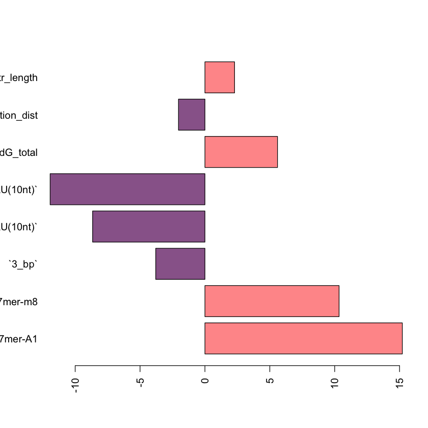

```R


# load UTR length
read.table("/Users/James/Desktop/ss/yale_project/mirna/miRTarget/TargetPredictions/UTR_Length/UTR3_lengths_human.txt",header=F)->UTR_len_h

#mir target data format

UTR_len_h[which(!UTR_len_h[,3]==0),]->UTR_len_h
UTR_len_h [which(!duplicated(UTR_len_h[,1])),]-> UTR_len_h
UTR_len_h[,3]-> UTR_len_h2
names(UTR_len_h2)<-UTR_len_h[,1]

# load UTR length
read.table("/Users/James/Desktop/ss/yale_project/mirna/miRTarget/TargetPredictions/UTR_Length/UTR3_lengths_mouse.txt",header=F,row.names=1)->mouse_3utr

mouse_3utr[,2]-> mouse_3utr2
names(mouse_3utr2)<- rownames(mouse_3utr)

c(UTR_len_h2, mouse_3utr2)->utr_all


 readRDS("/Users/James/Desktop/ss/yale_project/mirna/New_data/New_process_RDS3/merge_outs2_newbinding.rds")->merge_outs

readRDS("/Users/James/Desktop/ss/yale_project/mirna/New_data/New_process_RDS3/merge_mir124_3binidng.rds")->merge_mir124
readRDS("/Users/James/Desktop/ss/yale_project/mirna/New_data/New_process_RDS3/merge_mir122_3binidng.rds")-> merge_mir122
readRDS("/Users/James/Desktop/ss/yale_project/mirna/New_data/New_process_RDS3/merge_mir223_3binding.rds")-> merge_mir223
readRDS("/Users/James/Desktop/ss/yale_project/mirna/New_data/New_process_RDS3/merge_mir522_3binding.rds")-> merge_mir522
colnames(merge_mir522)<-colnames(merge_mir124)
rbind(merge_outs,data.frame(merge_mir124,miR ="merge_mir124"), data.frame(merge_mir122, miR ="merge_mir122"), data.frame(merge_mir522, miR ="merge_mir522"), data.frame(merge_mir223, miR ="merge_mir223"))-> merge_outs_tmp
merge(merge_outs_tmp,as.matrix(utr_all),by.x=1,by.y=0)-> merge_outs2


subset(merge_outs2, miR %in% c("miR_101_list","DU145_mir195","LNCaP_mir195","LNCaP_mir30d","DU145_mir30d","miR_146D1","miR_146_mouse","miR1966OE","miR_31","miR_100","miR_500M","miR_500T","miR_142D1","miR_22D1","merge_miR7_12h","merge_miR7_24h",   "merge_miR9_12h",  "merge_miR9_24h"  , "merge_miR122_12h", "merge_miR122_24h", "merge_miR132_12h","merge_miR132_24h", "merge_miR148_12h", "merge_miR148_24h", "merge_miR142_12h","merge_miR142_24h" ,"merge_miR181_12h" ,"merge_miR181_24h","miR_30aOV","merge_mir124","merge_mir522"))-> merge_outs_OE


subset(merge_outs2, miR %in% c("miR_1D1","miR_182","miR_30a","miR_30aKD","merge_mir122","merge_mir223"))-> merge_outs_KD
merge_outs_KD-> merge_outs_KD2
merge_outs_KD2[,2]<-merge_outs_KD[,2] * (-1)


rbind(merge_outs_KD2, merge_outs_OE)-> merge_outs_tmp
colnames(merge_outs_tmp)<-c("Row.names","logFC","miRNA","dG_hybrid","Seed_Type","3_bp","region4_15","Site_Location","Site_Access","Seed_Access","Upstream_Access(5nt)","Upstream_AU(5nt)","Dwstream_Access(5nt)","Dwstream_AU(5nt)","Upstream_Access(10nt)","Upstream_AU(10nt)","Dwstream_Access(10nt)","Dwstream_AU(10nt)","Upstream_Access(15nt)","Upstream_AU(15nt)","Dwstream_Access(15nt)","Dwstream_AU(15nt)","Upstream_Access(20nt)","Upstream_AU(20nt)","Dwstream_Access(20nt)","Dwstream_AU(20nt)","Upstream_Access(25nt)","Upstream_AU(25nt)","Dwstream_Access(25nt)","Dwstream_AU(25nt)","Upstream_Access(30nt)","Upstream_AU(30nt)","Dwstream_Access(30nt)","Dwstream_AU(30nt)","dG_total","dG_nucl","seedless","bind3","miR","utr_length")

#subset(merge_outs_tmp, miR %in% setdiff(merge_outs_tmp[,"miR"],c("LNCaP_mir30d","DU145_mir30d")))-> merge_outs_tmp

subset(merge_outs_tmp, Seed_Type %in% c("7mer-A1","7mer-m8","8mer"))-> merge_outs_filter

paste(merge_outs_filter[,1],merge_outs_filter[,"miR"],sep="_")->paste_genes
table(paste_genes)-> paste_genes_counts
which(paste_genes %in% names(which(paste_genes_counts==1)))->idx_uniq
merge_outs_filter[idx_uniq,]-> merge_outs_filter2


```


```R

#abs(merge_outs_filter2[,"Site_Location"]-0.5)->location  ###orinigal code 

merge_outs_filter2[,"Site_Location"]-> location

cbind(merge_outs_filter2, location)-> merge_outs_filter3


merge_outs_filter3[,c( "Row.names","logFC","Seed_Type","3_bp", "Upstream_AU(10nt)","Dwstream_AU(10nt)" ,"dG_total","seedless","miR","utr_length","location")]-> merge_outs_filter4

merge_outs_filter3[,c( "Row.names","logFC","Seed_Type","3_bp", "Upstream_AU(10nt)","Dwstream_AU(10nt)" ,"dG_total","seedless","miR","utr_length","location","bind3")]-> merge_outs_filter4


merge_outs_filter4$Seed_Type <- relevel(factor(merge_outs_filter4$Seed_Type) , ref="8mer")

merge_outs_filter4$location_dist <-  as.numeric(merge_outs_filter4$location < 1/3 | merge_outs_filter4$location > 2/3) #### new code2 direct using ratio


```


```R


merge_outs_filter4[,c( "Row.names","logFC","Seed_Type","3_bp", "Upstream_AU(10nt)","Dwstream_AU(10nt)" ,"dG_total","seedless","miR","utr_length","location_dist")]-> merge_outs_filter5

#merge_outs_filter4[,c( "Row.names","logFC","Seed_Type","3_bp", "Upstream_AU(10nt)","Dwstream_AU(10nt)" ,"dG_total","seedless","miR","utr_length","location_dist","bind3")]-> merge_outs_filter5


lm_all<-lm(logFC ~  .  , data= merge_outs_filter5[,-1])
coef(summary(lm_all))->coef_features
color=rep("#FF9999",length(coef_features[c(2:7,46,45,8),3]))
color[which(coef_features[c(2:7,46,45,8),3]<0)]="#996699"

barplot(coef_features[c(2:7,46,45,8),3],horiz=T,col= color,las=2)


lm_all<-lm(logFC ~ Seed_Type+ `3_bp`+ `Upstream_AU(10nt)` + `Dwstream_AU(10nt)` + dG_total + location_dist+ miR  + seedless * utr_length   , data= merge_outs_filter5[,-1]) 

coef(summary(lm_all))->coef_features
color=rep("#FF9999",length(coef_features[c(2:7,8,46,45,47),3]))
color[which(coef_features[c(2:7,8,46,45,47),3]<0)]="#996699"

barplot(coef_features[c(2:7,8,46,45,47),3],horiz=T,col= color,las=2)


```


    

    


    

    


```R
###### interaction term


lm_all<-lm(logFC ~ Seed_Type+ `3_bp`+ `Upstream_AU(10nt)` + `Dwstream_AU(10nt)` + dG_total + location_dist+ miR  + seedless * utr_length   , data= merge_outs_filter5[,-1]) 

coef(summary(lm_all))->coef_features
color=rep("#FF9999",length(coef_features[c(2:7,8,46,45,47),3]))
color[which(coef_features[c(2:7,8,46,45,47),3]<0)]="#996699"

barplot(coef_features[c(2:7,8,46,45,47),3],horiz=T,col= color,las=2)


```


    

    


```R


merge_outs_filter4[,c( "Row.names","logFC","Seed_Type","3_bp", "Upstream_AU(10nt)","Dwstream_AU(10nt)" ,"dG_total","miR","utr_length","location_dist")]-> merge_outs_filter6

lm_all<-lm(logFC ~ . , data= merge_outs_filter6[,-1])

summary(lm_all)

coef(summary(lm_all))->coef_features

color=rep("#FF9999",length(coef_features[c(2:7,45,44),3]))
color[which(coef_features[c(2:7,45,44),3]<0)]="#996699"

barplot(coef_features[c(2:7,45,44),3],horiz=T,col= color,las=2)


```


    
    Call:
    lm(formula = logFC ~ ., data = merge_outs_filter6[, -1])
    
    Residuals:
        Min      1Q  Median      3Q     Max 
    -4.8188 -0.0611  0.0110  0.0815  3.6120 
    
    Coefficients:
                          Estimate Std. Error t value Pr(>|t|)    
    (Intercept)          1.451e-01  8.385e-03  17.300  < 2e-16 ***
    Seed_Type7mer-A1     5.341e-02  3.511e-03  15.213  < 2e-16 ***
    Seed_Type7mer-m8     3.548e-02  3.432e-03  10.340  < 2e-16 ***
    `3_bp`              -1.371e-02  3.615e-03  -3.792 0.000149 ***
    `Upstream_AU(10nt)` -5.891e-02  6.806e-03  -8.656  < 2e-16 ***
    `Dwstream_AU(10nt)` -8.374e-02  7.019e-03 -11.929  < 2e-16 ***
    dG_total             8.405e-04  1.502e-04   5.594 2.23e-08 ***
    miRDU145_mir30d     -1.086e-01  9.059e-03 -11.987  < 2e-16 ***
    miRLNCaP_mir195     -1.167e-01  8.592e-03 -13.577  < 2e-16 ***
    miRLNCaP_mir30d     -8.938e-02  9.059e-03  -9.866  < 2e-16 ***
    miRmerge_mir122     -2.690e-01  1.001e-02 -26.864  < 2e-16 ***
    miRmerge_miR122_12h -1.310e-01  9.671e-03 -13.548  < 2e-16 ***
    miRmerge_miR122_24h -1.603e-01  9.757e-03 -16.426  < 2e-16 ***
    miRmerge_mir124     -2.678e-01  9.080e-03 -29.498  < 2e-16 ***
    miRmerge_miR132_12h -1.064e-01  9.752e-03 -10.912  < 2e-16 ***
    miRmerge_miR132_24h -1.297e-01  9.750e-03 -13.306  < 2e-16 ***
    miRmerge_miR142_12h -1.424e-01  1.176e-02 -12.113  < 2e-16 ***
    miRmerge_miR142_24h -1.420e-01  1.175e-02 -12.085  < 2e-16 ***
    miRmerge_miR148_12h -1.111e-01  9.466e-03 -11.741  < 2e-16 ***
    miRmerge_miR148_24h -1.244e-01  9.475e-03 -13.128  < 2e-16 ***
    miRmerge_miR181_12h -9.834e-02  9.064e-03 -10.849  < 2e-16 ***
    miRmerge_miR181_24h -1.050e-01  9.063e-03 -11.588  < 2e-16 ***
    miRmerge_mir223     -1.588e-01  9.979e-03 -15.909  < 2e-16 ***
    miRmerge_mir522     -1.512e-01  8.481e-03 -17.829  < 2e-16 ***
    miRmerge_miR7_12h   -1.210e-01  9.211e-03 -13.140  < 2e-16 ***
    miRmerge_miR7_24h   -1.188e-01  9.214e-03 -12.889  < 2e-16 ***
    miRmerge_miR9_12h   -1.089e-01  9.393e-03 -11.593  < 2e-16 ***
    miRmerge_miR9_24h   -1.136e-01  9.396e-03 -12.090  < 2e-16 ***
    miRmiR_100          -2.776e-01  2.277e-02 -12.190  < 2e-16 ***
    miRmiR_101_list     -1.347e-01  9.350e-03 -14.405  < 2e-16 ***
    miRmiR_142D1        -2.423e-01  1.317e-02 -18.405  < 2e-16 ***
    miRmiR_146_mouse    -1.547e-01  9.540e-03 -16.211  < 2e-16 ***
    miRmiR_146D1        -1.187e-01  9.401e-03 -12.630  < 2e-16 ***
    miRmiR_182          -9.478e-02  8.929e-03 -10.615  < 2e-16 ***
    miRmiR_1D1          -1.040e-01  9.623e-03 -10.808  < 2e-16 ***
    miRmiR_22D1         -1.737e-01  9.324e-03 -18.628  < 2e-16 ***
    miRmiR_30a          -8.283e-02  9.036e-03  -9.166  < 2e-16 ***
    miRmiR_30aKD        -1.246e-01  9.015e-03 -13.817  < 2e-16 ***
    miRmiR_30aOV        -1.614e-01  9.015e-03 -17.905  < 2e-16 ***
    miRmiR_31           -2.304e-01  9.295e-03 -24.790  < 2e-16 ***
    miRmiR_500M         -1.209e-01  9.514e-03 -12.706  < 2e-16 ***
    miRmiR_500T         -1.082e-01  9.514e-03 -11.377  < 2e-16 ***
    miRmiR1966OE        -1.094e-01  1.090e-02 -10.039  < 2e-16 ***
    utr_length           1.963e-06  8.591e-07   2.285 0.022338 *  
    location_dist       -5.125e-03  2.515e-03  -2.038 0.041556 *  
    ---
    Signif. codes:  0 ‘***’ 0.001 ‘**’ 0.01 ‘*’ 0.05 ‘.’ 0.1 ‘ ’ 1
    
    Residual standard error: 0.2974 on 62923 degrees of freedom
    Multiple R-squared:  0.03783,	Adjusted R-squared:  0.03716 
    F-statistic: 56.23 on 44 and 62923 DF,  p-value: < 2.2e-16


    

    


```R
coef_features
```


<table class="dataframe">
<caption>A matrix: 45 × 4 of type dbl</caption>
<thead>
	<tr><th></th><th scope=col>Estimate</th><th scope=col>Std. Error</th><th scope=col>t value</th><th scope=col>Pr(&gt;|t|)</th></tr>
</thead>
<tbody>
	<tr><th scope=row>(Intercept)</th><td> 1.450648e-01</td><td>8.385010e-03</td><td> 17.300487</td><td> 6.666560e-67</td></tr>
	<tr><th scope=row>Seed_Type7mer-A1</th><td> 5.341030e-02</td><td>3.510724e-03</td><td> 15.213472</td><td> 3.566072e-52</td></tr>
	<tr><th scope=row>Seed_Type7mer-m8</th><td> 3.548485e-02</td><td>3.431942e-03</td><td> 10.339582</td><td> 4.886282e-25</td></tr>
	<tr><th scope=row>`3_bp`</th><td>-1.371046e-02</td><td>3.615434e-03</td><td> -3.792202</td><td> 1.494570e-04</td></tr>
	<tr><th scope=row>`Upstream_AU(10nt)`</th><td>-5.891219e-02</td><td>6.805722e-03</td><td> -8.656273</td><td> 4.987205e-18</td></tr>
	<tr><th scope=row>`Dwstream_AU(10nt)`</th><td>-8.373752e-02</td><td>7.019366e-03</td><td>-11.929499</td><td> 9.012374e-33</td></tr>
	<tr><th scope=row>dG_total</th><td> 8.404617e-04</td><td>1.502465e-04</td><td>  5.593886</td><td> 2.229625e-08</td></tr>
	<tr><th scope=row>miRDU145_mir30d</th><td>-1.085881e-01</td><td>9.059072e-03</td><td>-11.986671</td><td> 4.534753e-33</td></tr>
	<tr><th scope=row>miRLNCaP_mir195</th><td>-1.166506e-01</td><td>8.591604e-03</td><td>-13.577274</td><td> 6.259266e-42</td></tr>
	<tr><th scope=row>miRLNCaP_mir30d</th><td>-8.937884e-02</td><td>9.059072e-03</td><td> -9.866224</td><td> 6.060022e-23</td></tr>
	<tr><th scope=row>miRmerge_mir122</th><td>-2.690241e-01</td><td>1.001423e-02</td><td>-26.864180</td><td>4.516419e-158</td></tr>
	<tr><th scope=row>miRmerge_miR122_12h</th><td>-1.310255e-01</td><td>9.670900e-03</td><td>-13.548429</td><td> 9.264955e-42</td></tr>
	<tr><th scope=row>miRmerge_miR122_24h</th><td>-1.602771e-01</td><td>9.757408e-03</td><td>-16.426193</td><td> 1.660995e-60</td></tr>
	<tr><th scope=row>miRmerge_mir124</th><td>-2.678406e-01</td><td>9.079816e-03</td><td>-29.498464</td><td>5.977268e-190</td></tr>
	<tr><th scope=row>miRmerge_miR132_12h</th><td>-1.064142e-01</td><td>9.752296e-03</td><td>-10.911707</td><td> 1.073002e-27</td></tr>
	<tr><th scope=row>miRmerge_miR132_24h</th><td>-1.297399e-01</td><td>9.750482e-03</td><td>-13.306001</td><td> 2.422271e-40</td></tr>
	<tr><th scope=row>miRmerge_miR142_12h</th><td>-1.424125e-01</td><td>1.175716e-02</td><td>-12.112831</td><td> 9.848818e-34</td></tr>
	<tr><th scope=row>miRmerge_miR142_24h</th><td>-1.419673e-01</td><td>1.174779e-02</td><td>-12.084598</td><td> 1.387992e-33</td></tr>
	<tr><th scope=row>miRmerge_miR148_12h</th><td>-1.111320e-01</td><td>9.465502e-03</td><td>-11.740743</td><td> 8.505270e-32</td></tr>
	<tr><th scope=row>miRmerge_miR148_24h</th><td>-1.243956e-01</td><td>9.475415e-03</td><td>-13.128248</td><td> 2.555532e-39</td></tr>
	<tr><th scope=row>miRmerge_miR181_12h</th><td>-9.833764e-02</td><td>9.064372e-03</td><td>-10.848809</td><td> 2.136563e-27</td></tr>
	<tr><th scope=row>miRmerge_miR181_24h</th><td>-1.050237e-01</td><td>9.063113e-03</td><td>-11.588043</td><td> 5.095159e-31</td></tr>
	<tr><th scope=row>miRmerge_mir223</th><td>-1.587554e-01</td><td>9.978921e-03</td><td>-15.909079</td><td> 7.079424e-57</td></tr>
	<tr><th scope=row>miRmerge_mir522</th><td>-1.512069e-01</td><td>8.481151e-03</td><td>-17.828586</td><td> 6.341908e-71</td></tr>
	<tr><th scope=row>miRmerge_miR7_12h</th><td>-1.210402e-01</td><td>9.211297e-03</td><td>-13.140414</td><td> 2.177114e-39</td></tr>
	<tr><th scope=row>miRmerge_miR7_24h</th><td>-1.187624e-01</td><td>9.214009e-03</td><td>-12.889333</td><td> 5.774475e-38</td></tr>
	<tr><th scope=row>miRmerge_miR9_12h</th><td>-1.088904e-01</td><td>9.392817e-03</td><td>-11.592941</td><td> 4.812551e-31</td></tr>
	<tr><th scope=row>miRmerge_miR9_24h</th><td>-1.135965e-01</td><td>9.396017e-03</td><td>-12.089859</td><td> 1.302112e-33</td></tr>
	<tr><th scope=row>miRmiR_100</th><td>-2.776092e-01</td><td>2.277262e-02</td><td>-12.190480</td><td> 3.817945e-34</td></tr>
	<tr><th scope=row>miRmiR_101_list</th><td>-1.346844e-01</td><td>9.349999e-03</td><td>-14.404751</td><td> 5.739043e-47</td></tr>
	<tr><th scope=row>miRmiR_142D1</th><td>-2.423226e-01</td><td>1.316595e-02</td><td>-18.405250</td><td> 1.883038e-75</td></tr>
	<tr><th scope=row>miRmiR_146_mouse</th><td>-1.546582e-01</td><td>9.540354e-03</td><td>-16.210948</td><td> 5.559818e-59</td></tr>
	<tr><th scope=row>miRmiR_146D1</th><td>-1.187342e-01</td><td>9.400832e-03</td><td>-12.630178</td><td> 1.594412e-36</td></tr>
	<tr><th scope=row>miRmiR_182</th><td>-9.477906e-02</td><td>8.929006e-03</td><td>-10.614738</td><td> 2.678957e-26</td></tr>
	<tr><th scope=row>miRmiR_1D1</th><td>-1.040150e-01</td><td>9.623447e-03</td><td>-10.808497</td><td> 3.315374e-27</td></tr>
	<tr><th scope=row>miRmiR_22D1</th><td>-1.736920e-01</td><td>9.324322e-03</td><td>-18.627843</td><td> 3.085916e-77</td></tr>
	<tr><th scope=row>miRmiR_30a</th><td>-8.282805e-02</td><td>9.036306e-03</td><td> -9.166141</td><td> 5.045221e-20</td></tr>
	<tr><th scope=row>miRmiR_30aKD</th><td>-1.245630e-01</td><td>9.015168e-03</td><td>-13.817043</td><td> 2.327935e-43</td></tr>
	<tr><th scope=row>miRmiR_30aOV</th><td>-1.614197e-01</td><td>9.015168e-03</td><td>-17.905343</td><td> 1.613550e-71</td></tr>
	<tr><th scope=row>miRmiR_31</th><td>-2.304148e-01</td><td>9.294836e-03</td><td>-24.789551</td><td>5.185032e-135</td></tr>
	<tr><th scope=row>miRmiR_500M</th><td>-1.208865e-01</td><td>9.514308e-03</td><td>-12.705760</td><td> 6.099355e-37</td></tr>
	<tr><th scope=row>miRmiR_500T</th><td>-1.082403e-01</td><td>9.514308e-03</td><td>-11.376577</td><td> 5.852461e-30</td></tr>
	<tr><th scope=row>miRmiR1966OE</th><td>-1.093861e-01</td><td>1.089619e-02</td><td>-10.038930</td><td> 1.070962e-23</td></tr>
	<tr><th scope=row>utr_length</th><td> 1.962721e-06</td><td>8.590985e-07</td><td>  2.284628</td><td> 2.233795e-02</td></tr>
	<tr><th scope=row>location_dist</th><td>-5.124936e-03</td><td>2.514718e-03</td><td> -2.037976</td><td> 4.155648e-02</td></tr>
</tbody>
</table>


```R
library(pheatmap)

bp=700

c(seq(1,4500,bp),10000000)->qq
#as.numeric(quantile(merge_outs_filter5[,"utr_length"],seq(0,1,1/6))) -> qq
out_matrix=c()
out_matrix2=c()

for (i in 1:length(qq[-1]))
{
subset(merge_outs_filter5, utr_length < qq[i+1] & utr_length >= qq[i])->out_miR_l3
print(dim(out_miR_l3))
coef(summary(lm(formula = logFC ~ Seed_Type + `3_bp`   + 
    `Upstream_AU(10nt)` + `Dwstream_AU(10nt)` + location_dist+
    dG_total  + factor(miR) + utr_length , data = out_miR_l3[, 
    -1])))-> step.model2

c("Seed_Type7mer-m8","Seed_Type7mer-A1","`3_bp`","`Upstream_AU(10nt)`","`Dwstream_AU(10nt)`","dG_total","utr_length","location_dist")->vars
out_matrix=rbind(out_matrix , step.model2[vars,3])
warnings()
out_matrix2=rbind(out_matrix2 , step.model2[vars,4])

}

out_matrix2->out_P_all2 -> out_P_all

out_P_all2[out_P_all <= 0.05] <- "*"
out_P_all2[out_P_all > 0.05] <- ""
out_P_all2[out_P_all < 0.01] <- "**"
out_P_all2[out_P_all < 0.001] <- "***"

c("Seed_Type7mer-m8","Seed_Type7mer-A1","`3_bp`","`Upstream_AU(10nt)`","`Dwstream_AU(10nt)`","dG_total","location_dist","seedless","utr_length" )->order_1

intersect(order_1,colnames(out_matrix))->order_2
pheatmap(out_matrix[, order_2],gaps_col = 1:8,gaps_row = 1:5, cluster_rows = F,fontsize_number=15,number_color="green",display_numbers = out_P_all2[, order_2], cluster_cols = F,breaks=seq(-6,6,length.out=400),col=colorRampPalette(c("navy","white","red"))(400),border_color = FALSE)


```

    [1] 11007    11
    [1] 15862    11
    [1] 13347    11
    [1] 8753   11
    [1] 5627   11
    [1] 3538   11
    [1] 4834   11


    

    


```R
library(pheatmap)

bp=700

c(seq(1,4500,bp),10000000)->qq
#as.numeric(quantile(merge_outs_filter5[,"utr_length"],seq(0,1,1/6))) -> qq
out_matrix=c()
out_matrix2=c()

for (i in 1:length(qq[-1]))
{
subset(merge_outs_filter5, utr_length < qq[i+1] & utr_length >= qq[i])->out_miR_l3
print(dim(out_miR_l3))
coef(summary(lm(formula = logFC ~ Seed_Type + `3_bp`   + 
    `Upstream_AU(10nt)` + `Dwstream_AU(10nt)` + location_dist+
    dG_total  + factor(miR) + seedless , data = out_miR_l3[, 
    -1])))-> step.model2

c("Seed_Type7mer-m8","Seed_Type7mer-A1","`3_bp`","`Upstream_AU(10nt)`","`Dwstream_AU(10nt)`","dG_total","seedless","location_dist")->vars
out_matrix=rbind(out_matrix , step.model2[vars,3])
warnings()
out_matrix2=rbind(out_matrix2 , step.model2[vars,4])

}

out_matrix2->out_P_all2 -> out_P_all

out_P_all2[out_P_all <= 0.05] <- "*"
out_P_all2[out_P_all > 0.05] <- ""
out_P_all2[out_P_all < 0.01] <- "**"
out_P_all2[out_P_all < 0.001] <- "***"

c("Seed_Type7mer-m8","Seed_Type7mer-A1","`3_bp`","`Upstream_AU(10nt)`","`Dwstream_AU(10nt)`","dG_total","location_dist","seedless","utr_length" )->order_1

intersect(order_1,colnames(out_matrix))->order_2
pheatmap(out_matrix[, order_2],gaps_col = 1:8,gaps_row = 1:5, cluster_rows = F,fontsize_number=15,number_color="green",display_numbers = out_P_all2[, order_2], cluster_cols = F,breaks=seq(-6,6,length.out=400),col=colorRampPalette(c("navy","white","red"))(400),border_color = FALSE)


```

    [1] 11007    11
    [1] 15862    11
    [1] 13347    11
    [1] 8753   11
    [1] 5627   11
    [1] 3538   11
    [1] 4834   11


    

    


```R


bp=12

c(seq(1,90,bp),10000000)->qq
#as.numeric(quantile(merge_outs_filter5[,"seedless"],seq(0,1,1/9))) -> qq
out_matrix=c()
out_matrix2=c()
for (i in 1:length(qq[-1]))
{
subset(merge_outs_filter5, seedless < qq[i+1] & seedless >= qq[i])->out_miR_l3
print(dim(out_miR_l3))
coef(summary(lm(formula = logFC ~ Seed_Type + `3_bp`   + 
    `Upstream_AU(10nt)` + `Dwstream_AU(10nt)` + location_dist+
    dG_total  + factor(miR) + utr_length , data = out_miR_l3[, 
    -1])))-> step.model2


out_matrix=rbind(out_matrix , step.model2[c("Seed_Type7mer-m8","Seed_Type7mer-A1","`3_bp`","`Upstream_AU(10nt)`","`Dwstream_AU(10nt)`","dG_total","utr_length","location_dist"),3])
out_matrix2=rbind(out_matrix2 , step.model2[c("Seed_Type7mer-m8","Seed_Type7mer-A1","`3_bp`","`Upstream_AU(10nt)`","`Dwstream_AU(10nt)`","dG_total","utr_length","location_dist"),4])

warnings()

}

out_matrix2->out_P_all2 -> out_P_all

out_P_all2[out_P_all <= 0.05] <- "*"
out_P_all2[out_P_all > 0.05] <- ""
out_P_all2[out_P_all < 0.01] <- "**"
out_P_all2[out_P_all < 0.001] <- "***"

c("Seed_Type7mer-m8","Seed_Type7mer-A1","`3_bp`","`Upstream_AU(10nt)`","`Dwstream_AU(10nt)`","dG_total","location_dist","seedless","utr_length" )->order_1

intersect(order_1,colnames(out_matrix))->order_2


pheatmap(out_matrix[, order_2],gaps_col = 1:8,gaps_row = 1:5, cluster_rows = F,fontsize_number=15,number_color="green",display_numbers = out_P_all2[, order_2], cluster_cols = F,breaks=seq(-6,6,length.out=400),col=colorRampPalette(c("navy","white","red"))(400),border_color = FALSE)


```

    [1] 10621    11
    [1] 12021    11
    [1] 9860   11
    [1] 7338   11
    [1] 5632   11
    [1] 3953   11
    [1] 3019   11
    [1] 10049    11


    

    


```R


bp=12

c(seq(1,90,bp),10000000)->qq
#as.numeric(quantile(merge_outs_filter5[,"seedless"],seq(0,1,1/9))) -> qq
out_matrix=c()
out_matrix2=c()
for (i in 1:length(qq[-1]))
{
subset(merge_outs_filter5, seedless < qq[i+1] & seedless >= qq[i])->out_miR_l3
print(dim(out_miR_l3))
coef(summary(lm(formula = logFC ~ Seed_Type + `3_bp`   + 
    `Upstream_AU(10nt)` + `Dwstream_AU(10nt)` + location_dist+
    dG_total  + factor(miR) + seedless , data = out_miR_l3[, 
    -1])))-> step.model2


out_matrix=rbind(out_matrix , step.model2[c("Seed_Type7mer-m8","Seed_Type7mer-A1","`3_bp`","`Upstream_AU(10nt)`","`Dwstream_AU(10nt)`","dG_total","seedless","location_dist"),3])
out_matrix2=rbind(out_matrix2 , step.model2[c("Seed_Type7mer-m8","Seed_Type7mer-A1","`3_bp`","`Upstream_AU(10nt)`","`Dwstream_AU(10nt)`","dG_total","seedless","location_dist"),4])

warnings()

}

out_matrix2->out_P_all2 -> out_P_all

out_P_all2[out_P_all <= 0.05] <- "*"
out_P_all2[out_P_all > 0.05] <- ""
out_P_all2[out_P_all < 0.01] <- "**"
out_P_all2[out_P_all < 0.001] <- "***"

c("Seed_Type7mer-m8","Seed_Type7mer-A1","`3_bp`","`Upstream_AU(10nt)`","`Dwstream_AU(10nt)`","dG_total","location_dist","seedless","utr_length" )->order_1

intersect(order_1,colnames(out_matrix))->order_2


pheatmap(out_matrix[, order_2],gaps_col = 1:8,gaps_row = 1:5, cluster_rows = F,fontsize_number=15,number_color="green",display_numbers = out_P_all2[, order_2], cluster_cols = F,breaks=seq(-6,6,length.out=400),col=colorRampPalette(c("navy","white","red"))(400),border_color = FALSE)


```

    [1] 10621    11
    [1] 12021    11
    [1] 9860   11
    [1] 7338   11
    [1] 5632   11
    [1] 3953   11
    [1] 3019   11
    [1] 10049    11


    

    


```R

```


```R

```


```R

```
