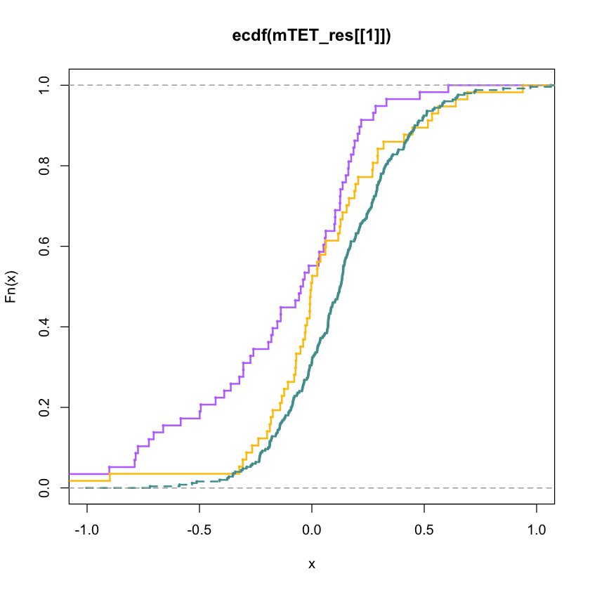
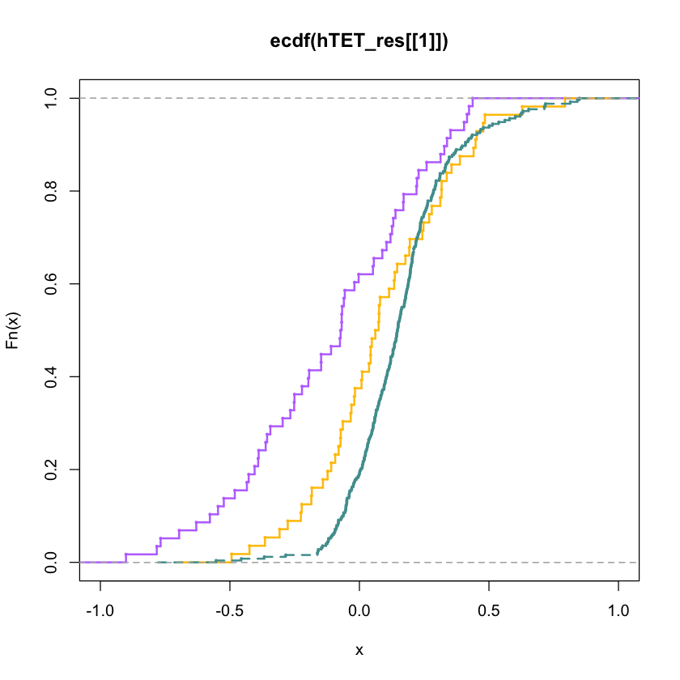
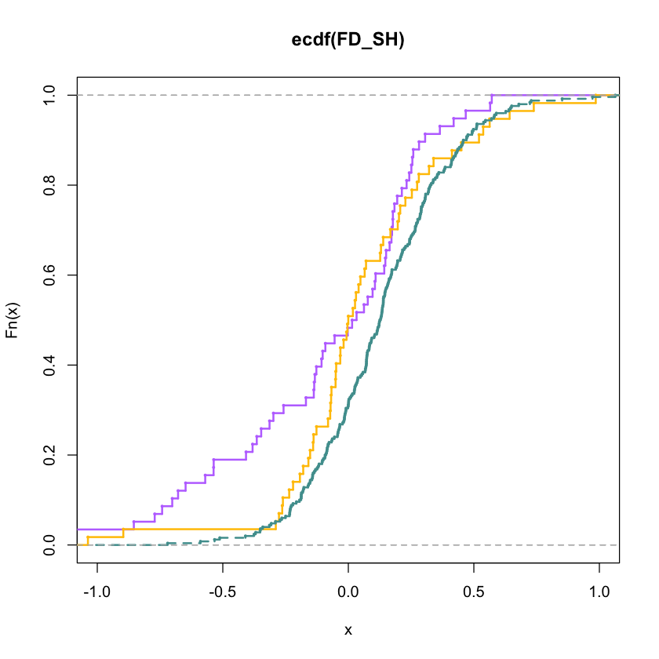

```R

#load report data
read.table("/Users/James/Desktop/ss/yale_project/mirna/miRTarget/miRTargets/UTR_reporter_data/Sites_count_allPairs_tet2_Steve.txt",sep="\t",header=T)->miR_data

miR_data[which(miR_data[,1]=="mTET2"),]-> mTET2
miR_data[which(miR_data[,1]=="hTET2"),]-> hTET2


miR_data[which(miR_data[,1]=="mTET2"),]-> mTET2
miR_data[which(miR_data[,1]=="hTET2"),]-> hTET2


##define function of regression load higher WS miR, lower, and non_ST FD

mir_plot<-function(gene_data,type)

{
    gene_data[-grep("cluster", gene_data[,2]),]-> gene_data1.1
   #gene_data->gene_data1.1
    gene_data1.1 [which(gene_data1.1[,"strand"]==type),]-> gene_data2
    rowSums(gene_data2[,c("count.8mer","count.7mer.A1","count.7mer.m8")])->SS
    which(SS>0)->SS_idx
    which(SS==0)->NS_idx
   # gene_data2[,"count.poor_Seedless"]->WS
  #  gene_data2[SS_idx,"count.poor_Seedless"]->WS_ss

   rowSums(gene_data2[,c("count.1GUmisMatch_Seedless","count.poor_Seedless")])->WS
    rowSums(gene_data2[SS_idx,c("count.1GUmisMatch_Seedless","count.poor_Seedless")])->WS_ss

    FDD<-log(gene_data2[,"RvF_ratio"],2)
    FDD[intersect(SS_idx ,which(WS<=quantile(WS_ss,1/3)))]->FD_SH
    FDD[intersect(SS_idx ,which(WS>quantile(WS_ss,2/3)))]->FD_L
    FDD[NS_idx]->FD_N
    list(FD_SH, FD_L, FD_N)
}

```


```R


mir_plot(mTET2,"major")->mTET_res
ecdf(mTET_res[[1]])->FN
plot(FN,verticals=TRUE,col="#BE77FF",lwd=2,cex=0.3,xlim=c(-1,1))
lines(ecdf(mTET_res[[2]]),col="#FFC300",verticals=TRUE,lwd=2,cex=0.3)
lines(ecdf(mTET_res[[3]]),col="#4F9D9D",verticals=TRUE,lty=2,lwd=2,cex=0.3)


```


    

    


```R

mir_plot(hTET2,"major")->hTET_res
ecdf(hTET_res[[1]])->FN
plot(FN,verticals=TRUE,col="#BE77FF",lwd=2,cex=0.3,xlim=c(-1,1))
lines(ecdf(hTET_res[[2]]),col="#FFC300",verticals=TRUE,lwd=2,cex=0.3)
lines(ecdf(hTET_res[[3]]),col="#4F9D9D",verticals=TRUE,lty=2,lwd=2,cex=0.3)


```


    

    


```R
library(gdata)
#read.xls("/Users/James/Desktop/ss/yale_project/mirna/New_data/new_miR/Major_minor_strand_definition_20140409.xlsx")->TET_AU
read.xls("/Users/James/Desktop/ss/yale_project/mirna/New_data/new_miR/Major_minor_strand_definition_updated.xlsx")->TET_AU


TET_AU[-grep("cluster",TET_AU[,1]),]-> TET_AU2
TET_AU2 [which(TET_AU2[,2]!="NaN" & TET_AU2[,3]!="#N/A" ),]-> TET_AU3
#na.omit(TET_AU3)
##### format transform
out_matrix=c()
for (line in 1:dim(TET_AU3)[1])

{
TET_AU3[line,]->select_line
as.vector(select_line[,2])->major
unlist(strsplit(major,";"))->major2
as.vector(select_line[,3])->sequence
unlist(strsplit(sequence,";"))-> sequence2
sequence2[which(major2=="1")]-> sequence_select
if(length(sequence_select)==0){sequence_select <-NA}
out=data.frame(as.vector(select_line[,1]), sequence_select)
out_matrix=rbind(out_matrix,out)
}

na.omit(out_matrix)-> out_matrix2
library(stringr)
GC<-function(sequence_miR)
{
substr(sequence_miR,1,8)-> sequence_miR2
#sequence_miR-> sequence_miR2
num_g <- str_count(sequence_miR2, "G")
num_c <- str_count(sequence_miR2, "C")
gc_content <- (num_g + num_c) / str_length(sequence_miR2)
gc_content
}
sapply(out_matrix2[,2],GC)->GC_number
cbind(out_matrix2, GC_number)-> out_matrix3
table(out_matrix3[,1])->miR_counts
colnames(out_matrix3)[1]<-"miR"
subset(out_matrix3,miR %in% names(which(miR_counts==1)))[,c(1,3)]-> out_matrix4

library(dplyr)

out_matrix3[,c(1,3)] %>% group_by(miR,GC_number) %>%summarise_all(mean)-> out_matrix4_2

data.frame(out_matrix4_2)-> out_matrix4_2

read.table("/Users/James/Desktop/ss/yale_project/mirna/miRTarget/miRTargets/UTR_reporter_data/Sites_count_allPairs_tet2_Steve.txt",sep="\t",header=T)->miR_data

miR_data[which(miR_data[,1]=="mTET2"),]-> mTET2
miR_data[which(miR_data[,1]=="hTET2"),]-> hTET2

#rbind(data.frame(mTET2,type="t1"), data.frame(hTET2,type="t2") )->gene_data

mTET2 -> gene_data

    gene_data[-grep("cluster", gene_data[,2]),]-> gene_data1.1
   
  gene_data1.1 [which(gene_data1.1[,"strand"]=="major"),]-> gene_data2
    rowSums(gene_data2[,c("count.8mer","count.7mer.A1","count.7mer.m8")])->SS
    which(SS>0)->SS_idx
    which(SS==0)->NS_idx
    #gene_data2[,"count.poor_Seedless"]->WS
        rowSums(gene_data2[,c("count.1GUmisMatch_Seedless","count.poor_Seedless")])->WS

cbind(gene_data2, WS,SS)-> gene_data3
merge(gene_data3, out_matrix4_2,by.x=13,by.y=1)-> gene_data4
subset(gene_data4, SS> 0)-> gene_data5

subset(gene_data4, SS== 0)-> gene_data_non
non_FD<-log(gene_data_non[,"RvF_ratio"],2)
non_FD2<-gene_data_non[,"RvF_ratio"]

coef(lm( log(RvF_ratio,2) ~ GC_number ,data=gene_data5))-> coeff
#coef(lm( RvF_ratio ~ GC_number ,data=gene_data5))->coeff

#0.04504 +log(gene_data5[,"RvF_ratio"],2)- 0.11333* gene_data5[,"GC_number"]->norm_FD
- coeff[1]- coeff[2]* gene_data5[,"GC_number"]+ log(gene_data5[,"RvF_ratio"],2) -> norm_FD

cbind(gene_data5, norm_FD)-> gene_data6
q<-quantile(gene_data6[,"WS"],c(1/3,2/3))
which(gene_data6[,"WS"]< q[1])->short_idx
which(gene_data6[,"WS"]> q[2])-> long_idx
gene_data6[short_idx,"norm_FD"]->FD_SH
gene_data6[long_idx,"norm_FD"]->FD_L

plot(ecdf(FD_SH),verticals=TRUE,col="#BE77FF",lwd=2,cex=0.3,xlim=c(-1,1))
lines(ecdf(FD_L),col="#FFC300",verticals=TRUE,lwd=2,cex=0.3)
lines(ecdf(non_FD),col="#4F9D9D",verticals=TRUE,lty=2,lwd=2,cex=0.3)

ks.test(FD_L,FD_SH,alternative="less")

```

    gdata: read.xls support for 'XLS' (Excel 97-2004) files ENABLED.
    
    
    
    gdata: read.xls support for 'XLSX' (Excel 2007+) files ENABLED.
    
    
    Attaching package: ‘gdata’
    
    
    The following object is masked from ‘package:stats’:
    
        nobs
    
    
    The following object is masked from ‘package:utils’:
    
        object.size
    
    
    The following object is masked from ‘package:base’:
    
        startsWith
    
    
    
    Attaching package: ‘dplyr’
    
    
    The following objects are masked from ‘package:gdata’:
    
        combine, first, last
    
    
    The following objects are masked from ‘package:stats’:
    
        filter, lag
    
    
    The following objects are masked from ‘package:base’:
    
        intersect, setdiff, setequal, union
    
    


    
    	Two-sample Kolmogorov-Smirnov test
    
    data:  FD_L and FD_SH
    D^- = 0.25802, p-value = 0.02176
    alternative hypothesis: the CDF of x lies below that of y


    

    


```R

hTET2 -> gene_data

    gene_data[-grep("cluster", gene_data[,2]),]-> gene_data1.1
   
  gene_data1.1 [which(gene_data1.1[,"strand"]=="major"),]-> gene_data2
    rowSums(gene_data2[,c("count.8mer","count.7mer.A1","count.7mer.m8")])->SS
    which(SS>0)->SS_idx
    which(SS==0)->NS_idx
    #gene_data2[,"count.poor_Seedless"]->WS
        rowSums(gene_data2[,c("count.1GUmisMatch_Seedless","count.poor_Seedless")])->WS

cbind(gene_data2, WS,SS)-> gene_data3
merge(gene_data3, out_matrix4_2,by.x=13,by.y=1)-> gene_data4
subset(gene_data4, SS> 0)-> gene_data5

subset(gene_data4, SS== 0)-> gene_data_non
non_FD<-log(gene_data_non[,"RvF_ratio"],2)
non_FD2<-gene_data_non[,"RvF_ratio"]

coef(lm( log(RvF_ratio,2) ~ GC_number ,data=gene_data5))-> coeff
#coef(lm( RvF_ratio ~ GC_number ,data=gene_data5))->coeff

#0.04504 +log(gene_data5[,"RvF_ratio"],2)- 0.11333* gene_data5[,"GC_number"]->norm_FD
- coeff[1]- coeff[2]* gene_data5[,"GC_number"]+ log(gene_data5[,"RvF_ratio"],2) -> norm_FD

cbind(gene_data5, norm_FD)-> gene_data6
q<-quantile(gene_data6[,"WS"],c(1/3,2/3))
which(gene_data6[,"WS"]< q[1])->short_idx
which(gene_data6[,"WS"]> q[2])-> long_idx
gene_data6[short_idx,"norm_FD"]->FD_SH
gene_data6[long_idx,"norm_FD"]->FD_L

plot(ecdf(FD_SH),verticals=TRUE,col="#BE77FF",lwd=2,cex=0.3,xlim=c(-1,1))
lines(ecdf(FD_L),col="#FFC300",verticals=TRUE,lwd=2,cex=0.3)
lines(ecdf(non_FD),col="#4F9D9D",verticals=TRUE,lty=2,lwd=2,cex=0.3)
ks.test(FD_L,FD_SH,alternative="less")


```


    
    	Two-sample Kolmogorov-Smirnov test
    
    data:  FD_L and FD_SH
    D^- = 0.28264, p-value = 0.01055
    alternative hypothesis: the CDF of x lies below that of y


    

    


```R

```


```R

```


```R

```


```R

```
