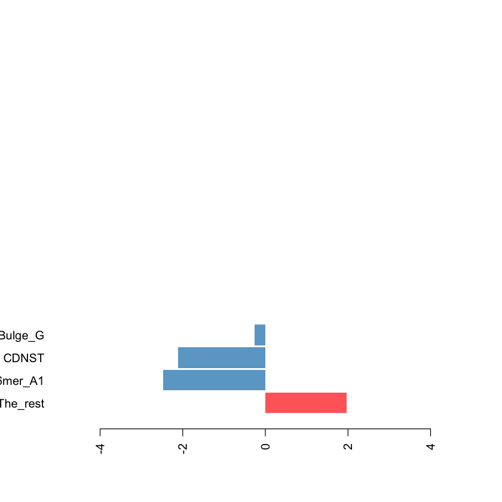
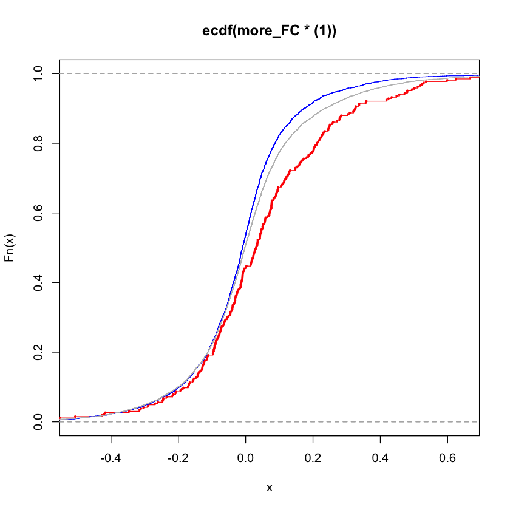
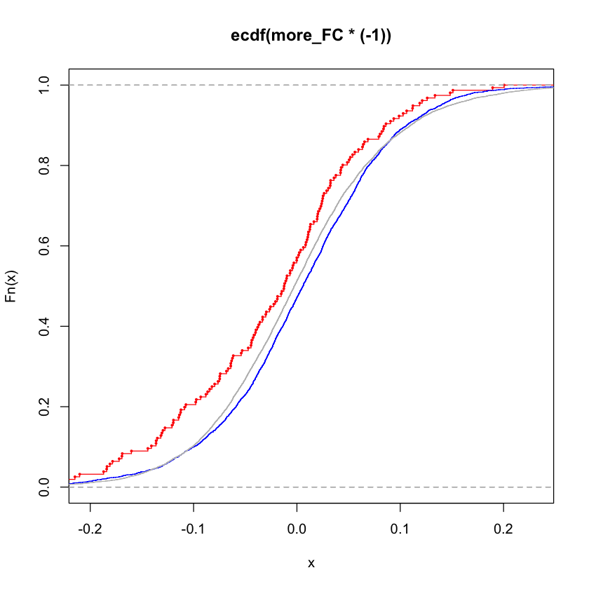

```R


readRDS("/Users/James/Desktop/交大其他课题/yale_project/Jun_project/seedless_2021/seedless_Counts/SL_May_5.rds")->SL_counts

 SL_counts[SL_counts[,"miR"] == "miR-122-5p-Seedless.txt","miR"] <- "mmu-miR-122-5p"

 SL_counts[SL_counts[,"miR"] == "hsa-miR522-3p-Seedless3pUTR.txt","miR"] <- "hsa-miR-522-3p"

 SL_counts[SL_counts[,"miR"] == "hsa-miR-124-3p-seedless_3pUTR.txt","miR"] <- "hsa-miR-124-3p"

 SL_counts[SL_counts[,"miR"] == "miR-223-3p-Seedless.txt","miR"] <- "mmu-miR-223-3p"


# load UTR length
read.table("/Users/James/Desktop/交大其他课题/yale_project/mirna/miRTarget/TargetPredictions/UTR_Length/UTR3_lengths_human.txt",header=F)->UTR_len_h

#mir target data format

UTR_len_h[which(!UTR_len_h[,3]==0),]->UTR_len_h
UTR_len_h [which(!duplicated(UTR_len_h[,1])),]-> UTR_len_h
UTR_len_h[,3]-> UTR_len_h2
names(UTR_len_h2)<-UTR_len_h[,1]

# load UTR length
read.table("/Users/James/Desktop/交大其他课题/yale_project/mirna/miRTarget/TargetPredictions/UTR_Length/UTR3_lengths_mouse.txt",header=F,row.names=1)->mouse_3utr

mouse_3utr[,2]-> mouse_3utr2
names(mouse_3utr2)<- rownames(mouse_3utr)

c(UTR_len_h2, mouse_3utr2)->utr_all


```


```R

setwd("/Users/James/Desktop/交大其他课题/yale_project/Jun_project/seedless_2021/seedless_Counts/NTS_data2")

dir()->file
KO_data<-c("NTS_miR_30a_list.rds","miR_223_local.rds","miR_122_local2.rds","NTS_miR_1_2.rds","NTS_miR_182.rds","NTS_miR_30aO.rds")

merge_allfile=c()
for (one_file in file)
{
readRDS(one_file)->file_rds
colnames(file_rds)<-c("Gene","log2FC","seedless","CDNST1","CDNST2","CDNST3","CDNST4","New_bulge_G","New_bulge_T2")
file_rds2<-data.frame(file_rds,file_name= one_file)
if (one_file %in% KO_data)
	{print (one_file)
	print(head(file_rds2))
	file_rds2$log2FC <- file_rds2$log2FC*(-1)
	print(head(file_rds2))
	
	}
merge_allfile=rbind(merge_allfile, file_rds2)
}

```

    [1] "miR_122_local2.rds"
              Gene       log2FC seedless CDNST1 CDNST2 CDNST3 CDNST4 New_bulge_G
    1 NM_001001144 -0.309558108        5      0      0      0      0           0
    2 NM_001001152 -0.045534205       34      0      0      0      0           0
    3 NM_001001177 -0.038778513       14      0      0      0      0           0
    4 NM_001001180  0.004103725       75      0      0      0      0           0
    5 NM_001001181  0.153246733       16      0      0      0      0           0
    6 NM_001001183  0.367345844       23      0      0      0      0           0
      New_bulge_T2          file_name
    1            0 miR_122_local2.rds
    2            0 miR_122_local2.rds
    3            0 miR_122_local2.rds
    4            0 miR_122_local2.rds
    5            0 miR_122_local2.rds
    6            0 miR_122_local2.rds
              Gene       log2FC seedless CDNST1 CDNST2 CDNST3 CDNST4 New_bulge_G
    1 NM_001001144  0.309558108        5      0      0      0      0           0
    2 NM_001001152  0.045534205       34      0      0      0      0           0
    3 NM_001001177  0.038778513       14      0      0      0      0           0
    4 NM_001001180 -0.004103725       75      0      0      0      0           0
    5 NM_001001181 -0.153246733       16      0      0      0      0           0
    6 NM_001001183 -0.367345844       23      0      0      0      0           0
      New_bulge_T2          file_name
    1            0 miR_122_local2.rds
    2            0 miR_122_local2.rds
    3            0 miR_122_local2.rds
    4            0 miR_122_local2.rds
    5            0 miR_122_local2.rds
    6            0 miR_122_local2.rds
    [1] "miR_223_local.rds"
            Gene log2FC seedless CDNST1 CDNST2 CDNST3 CDNST4 New_bulge_G
    1 0610007P08 -0.407        0      0      0      0      0           0
    2 0610009B14 -0.157        0      0      0      0      0           0
    3 0610010D24  0.093        0      0      0      0      0           0
    4 0610010G04 -0.210        0      0      0      0      0           0
    5 0610010M13 -0.075        0      0      0      0      0           0
    6 0610011D16  0.130        0      0      0      0      0           0
      New_bulge_T2         file_name
    1            0 miR_223_local.rds
    2            0 miR_223_local.rds
    3            0 miR_223_local.rds
    4            0 miR_223_local.rds
    5            0 miR_223_local.rds
    6            0 miR_223_local.rds
            Gene log2FC seedless CDNST1 CDNST2 CDNST3 CDNST4 New_bulge_G
    1 0610007P08  0.407        0      0      0      0      0           0
    2 0610009B14  0.157        0      0      0      0      0           0
    3 0610010D24 -0.093        0      0      0      0      0           0
    4 0610010G04  0.210        0      0      0      0      0           0
    5 0610010M13  0.075        0      0      0      0      0           0
    6 0610011D16 -0.130        0      0      0      0      0           0
      New_bulge_T2         file_name
    1            0 miR_223_local.rds
    2            0 miR_223_local.rds
    3            0 miR_223_local.rds
    4            0 miR_223_local.rds
    5            0 miR_223_local.rds
    6            0 miR_223_local.rds
    [1] "NTS_miR_1_2.rds"
              Gene      log2FC seedless CDNST1 CDNST2 CDNST3 CDNST4 New_bulge_G
    1 NM_001001144  0.28697302        1      0      0      0      0           0
    2 NM_001001152  0.18676864        7      0      0      0      0           0
    3 NM_001001176 -0.04691550       13      0      0      0      0           0
    4 NM_001001177  0.07896499        2      0      0      0      0           0
    5 NM_001001180  0.08738888       14      0      0      0      0           0
    6 NM_001001181 -0.03071100        5      0      0      0      0           0
      New_bulge_T2       file_name
    1            0 NTS_miR_1_2.rds
    2            0 NTS_miR_1_2.rds
    3            0 NTS_miR_1_2.rds
    4            0 NTS_miR_1_2.rds
    5            0 NTS_miR_1_2.rds
    6            0 NTS_miR_1_2.rds
              Gene      log2FC seedless CDNST1 CDNST2 CDNST3 CDNST4 New_bulge_G
    1 NM_001001144 -0.28697302        1      0      0      0      0           0
    2 NM_001001152 -0.18676864        7      0      0      0      0           0
    3 NM_001001176  0.04691550       13      0      0      0      0           0
    4 NM_001001177 -0.07896499        2      0      0      0      0           0
    5 NM_001001180 -0.08738888       14      0      0      0      0           0
    6 NM_001001181  0.03071100        5      0      0      0      0           0
      New_bulge_T2       file_name
    1            0 NTS_miR_1_2.rds
    2            0 NTS_miR_1_2.rds
    3            0 NTS_miR_1_2.rds
    4            0 NTS_miR_1_2.rds
    5            0 NTS_miR_1_2.rds
    6            0 NTS_miR_1_2.rds
    [1] "NTS_miR_182.rds"
           Gene        log2FC seedless CDNST1 CDNST2 CDNST3 CDNST4 New_bulge_G
    1 NM_000014  0.0032534761        2      0      0      0      0           0
    2 NM_000015 -0.0031685922        2      0      0      0      0           0
    3 NM_000016  0.0988916017        7      0      0      0      0           0
    4 NM_000017 -0.0133960283       33      0      0      0      0           0
    5 NM_000019  0.0834106550        7      0      0      0      0           0
    6 NM_000022 -0.0003624514        9      0      0      0      0           0
      New_bulge_T2       file_name
    1            0 NTS_miR_182.rds
    2            0 NTS_miR_182.rds
    3            0 NTS_miR_182.rds
    4            0 NTS_miR_182.rds
    5            0 NTS_miR_182.rds
    6            0 NTS_miR_182.rds
           Gene        log2FC seedless CDNST1 CDNST2 CDNST3 CDNST4 New_bulge_G
    1 NM_000014 -0.0032534761        2      0      0      0      0           0
    2 NM_000015  0.0031685922        2      0      0      0      0           0
    3 NM_000016 -0.0988916017        7      0      0      0      0           0
    4 NM_000017  0.0133960283       33      0      0      0      0           0
    5 NM_000019 -0.0834106550        7      0      0      0      0           0
    6 NM_000022  0.0003624514        9      0      0      0      0           0
      New_bulge_T2       file_name
    1            0 NTS_miR_182.rds
    2            0 NTS_miR_182.rds
    3            0 NTS_miR_182.rds
    4            0 NTS_miR_182.rds
    5            0 NTS_miR_182.rds
    6            0 NTS_miR_182.rds
    [1] "NTS_miR_30a_list.rds"
           Gene      log2FC seedless CDNST1 CDNST2 CDNST3 CDNST4 New_bulge_G
    1 NM_000014  0.13162104        1      0      0      0      0           0
    2 NM_000015 -0.09412285        0      0      0      0      0           0
    3 NM_000016  0.20055501        2      0      0      0      0           0
    4 NM_000017  0.16805625       22      0      0      0      0           0
    5 NM_000019  0.14148911        0      0      0      0      0           0
    6 NM_000020  0.10201983       61      0      0      0      0           0
      New_bulge_T2            file_name
    1            0 NTS_miR_30a_list.rds
    2            0 NTS_miR_30a_list.rds
    3            0 NTS_miR_30a_list.rds
    4            0 NTS_miR_30a_list.rds
    5            0 NTS_miR_30a_list.rds
    6            0 NTS_miR_30a_list.rds
           Gene      log2FC seedless CDNST1 CDNST2 CDNST3 CDNST4 New_bulge_G
    1 NM_000014 -0.13162104        1      0      0      0      0           0
    2 NM_000015  0.09412285        0      0      0      0      0           0
    3 NM_000016 -0.20055501        2      0      0      0      0           0
    4 NM_000017 -0.16805625       22      0      0      0      0           0
    5 NM_000019 -0.14148911        0      0      0      0      0           0
    6 NM_000020 -0.10201983       61      0      0      0      0           0
      New_bulge_T2            file_name
    1            0 NTS_miR_30a_list.rds
    2            0 NTS_miR_30a_list.rds
    3            0 NTS_miR_30a_list.rds
    4            0 NTS_miR_30a_list.rds
    5            0 NTS_miR_30a_list.rds
    6            0 NTS_miR_30a_list.rds
    [1] "NTS_miR_30aO.rds"
           Gene      log2FC seedless CDNST1 CDNST2 CDNST3 CDNST4 New_bulge_G
    1 NM_000014 -0.14552039        1      0      0      0      0           0
    2 NM_000015 -0.07212155        0      0      0      0      0           0
    3 NM_000016  0.09161812        2      0      0      0      0           0
    4 NM_000017  0.04550286       22      0      0      0      0           0
    5 NM_000019 -0.01844490        0      0      0      0      0           0
    6 NM_000020 -0.07311346       61      0      0      0      0           0
      New_bulge_T2        file_name
    1            0 NTS_miR_30aO.rds
    2            0 NTS_miR_30aO.rds
    3            0 NTS_miR_30aO.rds
    4            0 NTS_miR_30aO.rds
    5            0 NTS_miR_30aO.rds
    6            0 NTS_miR_30aO.rds
           Gene      log2FC seedless CDNST1 CDNST2 CDNST3 CDNST4 New_bulge_G
    1 NM_000014  0.14552039        1      0      0      0      0           0
    2 NM_000015  0.07212155        0      0      0      0      0           0
    3 NM_000016 -0.09161812        2      0      0      0      0           0
    4 NM_000017 -0.04550286       22      0      0      0      0           0
    5 NM_000019  0.01844490        0      0      0      0      0           0
    6 NM_000020  0.07311346       61      0      0      0      0           0
      New_bulge_T2        file_name
    1            0 NTS_miR_30aO.rds
    2            0 NTS_miR_30aO.rds
    3            0 NTS_miR_30aO.rds
    4            0 NTS_miR_30aO.rds
    5            0 NTS_miR_30aO.rds
    6            0 NTS_miR_30aO.rds


```R
rbind(c("miR_122_local2.rds","mmu-miR-122-5p"),c("miR_124_local2.rds","hsa-miR-124-3p") ,c("miR_223_local.rds","mmu-miR-223-3p"),
c("miR_522_local.rds","hsa-miR-522-3p"), c("NTS_DU145_mir195.rds","hsa-miR-195-5p"),c("NTS_DU145_mir30d.rds","hsa-miR-30d-5p"),
c("NTS_LNCaP_mir195.rds","hsa-miR-195-5p"), c("NTS_LNCaP_mir30d.rds","hsa-miR-30d-5p"),c("NTS_merge_miR122_12h.rds","hsa-miR-122-5p"),
c("NTS_merge_miR122_24h.rds","hsa-miR-122-5p"), c("NTS_merge_miR132_12h.rds","hsa-miR-132-3p"),c("NTS_merge_miR132_24h.rds","hsa-miR-132-3p"),
c("NTS_merge_miR142_12h.rds","hsa-miR-142-3p"), c("NTS_merge_miR142_24h.rds","hsa-miR-142-3p"),c("NTS_merge_miR148_12h.rds","hsa-miR-148b-3p"),
c("NTS_merge_miR148_24h.rds","hsa-miR-148b-3p"), c("NTS_merge_miR181_12h.rds","hsa-miR-181a-5p"),c("NTS_merge_miR181_24h.rds","hsa-miR-181a-5p"),
c("NTS_merge_miR7_12h.rds","hsa-miR-7-5p"), c("NTS_merge_miR7_24h.rds","hsa-miR-7-5p"),c("NTS_merge_miR9_12h.rds","hsa-miR-9-5p"),
c("NTS_merge_miR9_24h.rds","hsa-miR-9-5p"), c("NTS_miR_1_2.rds","mmu-miR-1a-3p"),c("NTS_miR_100a.rds","hsa-miR-100-5p"),
c("NTS_miR_101_list.rds","hsa-miR-101-3p"), c("NTS_miR_142aR.rds","hsa-miR-142-3p"),c("NTS_miR_146_human.rds","hsa-miR-146a-5p"),
c("NTS_miR_146_mouse.rds","mmu-miR-146a-5p"), c("NTS_miR_182.rds","hsa-miR-182-5p"),c("NTS_miR_196b.rds","hsa-miR-196b-5p"),
c("NTS_miR_30aOV_list.rds","hsa-miR-30a-5p"), c("NTS_miR_31.rds","hsa-miR-31-5p"),c("NTS_miR_500aM.rds","hsa-miR-500a-5p"),
c("NTS_miR_500aT.rds","hsa-miR-500a-5p"), c("NTS_miR_22.rds","hsa-miR-22-3p") , c("NTS_miR_30a_list.rds","hsa-miR-30a-5p"),
c("NTS_miR_30aO.rds","hsa-miR-30a-5p")) ->meta_miRs

merge_allfile$file_name<-as.vector(merge_allfile$file_name)
merge(merge_allfile, meta_miRs,by.x="file_name", by.y = 1)-> merge_allfile2

merge_allfile3=c()
for (cand_miR in unique(SL_counts[,"miR"] ))
{
print (cand_miR)
subset(SL_counts , miR == cand_miR) ->p1
subset(merge_allfile2 , V2 == cand_miR) ->p2
merge(p2,p1,by.x= 2, by.y = 1,all.x=T) ->merge_P
merge_P[is.na(merge_P)]=0
merge_allfile3 = rbind(merge_allfile3 , merge_P )

}

colnames(merge_allfile3)[15:20]<-c("CDNST1",
"CDNST2","CDNST3","CDNST4","New_bulge_G","New_bulge_T2")

```

    [1] "hsa-miR-100-5p"
    [1] "hsa-miR-101-3p"
    [1] "hsa-miR-122-5p"
    [1] "hsa-miR-124-3p"
    [1] "hsa-miR-132-3p"
    [1] "hsa-miR-142-3p"
    [1] "hsa-miR-146a-5p"
    [1] "hsa-miR-148b-3p"
    [1] "hsa-miR-181a-5p"
    [1] "hsa-miR-182-5p"
    [1] "hsa-miR-195-5p"
    [1] "hsa-miR-196b-5p"
    [1] "hsa-miR-22-3p"
    [1] "hsa-miR-30a-5p"
    [1] "hsa-miR-30d-5p"
    [1] "hsa-miR-31-5p"
    [1] "hsa-miR-500a-5p"
    [1] "hsa-miR-7-5p"
    [1] "hsa-miR-9-5p"
    [1] "hsa-miR-522-3p"
    [1] "mmu-miR-122-5p"
    [1] "mmu-miR-223-3p"
    [1] "mmu-miR-146a-5p"
    [1] "mmu-miR-1a-3p"


```R
coef(summary(glm(log2FC~ file_name + I(seedless-CDNST1-CDNST2-CDNST3-CDNST4-s6mer_A1- New_bulge_G)  +s6mer_A1 +  I(CDNST1+CDNST2+CDNST3+CDNST4) + New_bulge_G ,data= merge_allfile3[,-1])))->figure_coef

### new 6mer
figure_coef[c((dim(figure_coef)[1]-3):dim(figure_coef)[1]),3] -> uni
names(uni)<-c("The_rest","s6mer_A1","CDNST","Bulge_G")
barplot(uni,horiz=T,width=0.3,space=0.1,ylim=c(0,5),border=F,col=c("#FF6A6A","#6CA6CD","#6CA6CD","#6CA6CD"),xlim=c(-5,5),las=2)

merge(merge_allfile3, as.matrix(utr_all),by.x=1,by.y=0)-> merge_allfile4
unique(merge_allfile4[,c("Gene","V2","V1","seedless")])->out_values


```


    

    


```R

colSums(merge_allfile3[,c(4,12:20)])->sum_out
sum(sum_out[2:5])/sum_out[1]
sum(sum_out[6])/sum_out[1]
sum(sum_out[4])/sum_out[1]

```


<strong>seedless:</strong> 0.00262337526681114


<strong>seedless:</strong> 0.00165844578714529


<strong>seedless:</strong> 0.000817236191961889


```R

subset(merge_allfile3,file_name ==  "NTS_miR_22.rds") ->filter_data
filter_data2 <- data.frame(filter_data,other_seedless= filter_data[,"seedless"]- rowSums(filter_data[,c("CDNST1","CDNST2","CDNST3","CDNST4","New_bulge_G","off_6mer","off_7mer","s6mer_A1")]))

#filter_data2 <- data.frame(filter_data,other_seedless= filter_data[,"seedless"])

quan_q<-quantile(filter_data2[,"other_seedless"],c(1/3,2/3))

subset(filter_data2, other_seedless > 70)[,"log2FC"] ->more_FC
subset(filter_data2, other_seedless <= quan_q[1])[,"log2FC"] ->fewer_FC

quan_fc<-quantile(filter_data2[,"log2FC"],c(0.01,0.99))

plot(ecdf(more_FC*(1)),col="red",xlim= quan_fc, cex=0.3,verticals=T)
lines(ecdf(fewer_FC*(1)), col="blue",cex=0.1,verticals=T)
lines(ecdf(filter_data2[,"log2FC"]*(1)), col="grey")


c(length(more_FC),length(fewer_FC),length(filter_data2[,"log2FC"]))
ks.test(more_FC, fewer_FC,alternative="less" )


```


<style>
.list-inline {list-style: none; margin:0; padding: 0}
.list-inline>li {display: inline-block}
.list-inline>li:not(:last-child)::after {content: "\00b7"; padding: 0 .5ex}
</style>
<ol class=list-inline><li>266</li><li>3764</li><li>10754</li></ol>


    
    	Two-sample Kolmogorov-Smirnov test
    
    data:  more_FC and fewer_FC
    D^- = 0.17598, p-value = 2.075e-07
    alternative hypothesis: the CDF of x lies below that of y


    

    


```R


subset(merge_allfile3,file_name ==  "NTS_miR_30aO.rds") ->filter_data
filter_data2 <- data.frame(filter_data,other_seedless= filter_data[,"seedless"]- rowSums(filter_data[,c("CDNST1","CDNST2","CDNST3","CDNST4","New_bulge_G","off_6mer","off_7mer","s6mer_A1")]))

#filter_data2 <- data.frame(filter_data,other_seedless= filter_data[,"seedless"])

quan_q<-quantile(filter_data2[,"other_seedless"],c(1/3,2/3))

subset(filter_data2, other_seedless > 80)[,"log2FC"] ->more_FC
subset(filter_data2, other_seedless <= quan_q[1])[,"log2FC"] ->fewer_FC

quan_fc<-quantile(filter_data2[,"log2FC"],c(0.01,0.99))

plot(ecdf(more_FC*(-1)),col="red",xlim= quan_fc, cex=0.3,verticals=T)
lines(ecdf(fewer_FC*(-1)), col="blue",cex=0.1,verticals=T)
lines(ecdf(filter_data2[,"log2FC"]*(1)), col="grey")


c(length(more_FC),length(fewer_FC),length(filter_data2[,"log2FC"]))
ks.test(more_FC, fewer_FC,alternative="less" )


```


<style>
.list-inline {list-style: none; margin:0; padding: 0}
.list-inline>li {display: inline-block}
.list-inline>li:not(:last-child)::after {content: "\00b7"; padding: 0 .5ex}
</style>
<ol class=list-inline><li>156</li><li>3528</li><li>10098</li></ol>


    
    	Two-sample Kolmogorov-Smirnov test
    
    data:  more_FC and fewer_FC
    D^- = 0.1339, p-value = 0.004716
    alternative hypothesis: the CDF of x lies below that of y


    

    


```R

```
