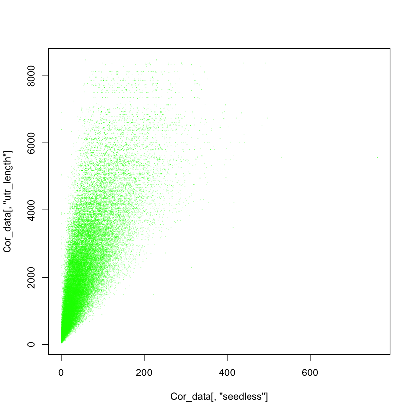
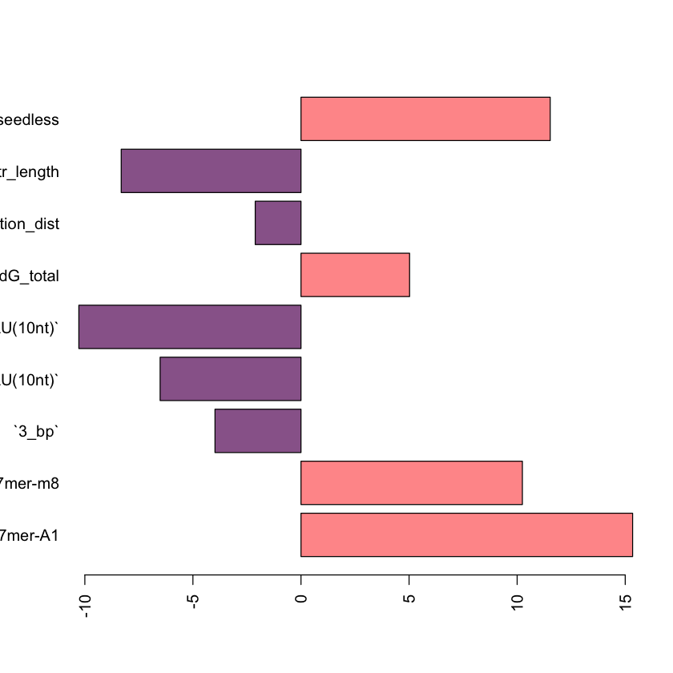

```R


# load UTR length
read.table("/Users/James/Desktop/交大其他课题/yale_project/mirna/miRTarget/TargetPredictions/UTR_Length/UTR3_lengths_human.txt",header=F)->UTR_len_h

#mir target data format

UTR_len_h[which(!UTR_len_h[,3]==0),]->UTR_len_h
UTR_len_h [which(!duplicated(UTR_len_h[,1])),]-> UTR_len_h
UTR_len_h[,3]-> UTR_len_h2
names(UTR_len_h2)<-UTR_len_h[,1]

# load UTR length
read.table("/Users/James/Desktop/交大其他课题/yale_project/mirna/miRTarget/TargetPredictions/UTR_Length/UTR3_lengths_mouse.txt",header=F,row.names=1)->mouse_3utr

mouse_3utr[,2]-> mouse_3utr2
names(mouse_3utr2)<- rownames(mouse_3utr)

c(UTR_len_h2, mouse_3utr2)->utr_all


 readRDS("/Users/James/Desktop/交大其他课题/yale_project/mirna/New_data/New_process_RDS3/merge_outs2_newbinding.rds")->merge_outs

readRDS("/Users/James/Desktop/交大其他课题/yale_project/mirna/New_data/New_process_RDS3/merge_mir124_3binidng.rds")->merge_mir124
readRDS("/Users/James/Desktop/交大其他课题/yale_project/mirna/New_data/New_process_RDS3/merge_mir122_3binidng.rds")-> merge_mir122
readRDS("/Users/James/Desktop/交大其他课题/yale_project/mirna/New_data/New_process_RDS3/merge_mir223_3binding.rds")-> merge_mir223
readRDS("/Users/James/Desktop/交大其他课题/yale_project/mirna/New_data/New_process_RDS3/merge_mir522_3binding.rds")-> merge_mir522
colnames(merge_mir522)<-colnames(merge_mir124)
rbind(merge_outs,data.frame(merge_mir124,miR ="merge_mir124"), data.frame(merge_mir122, miR ="merge_mir122"), data.frame(merge_mir522, miR ="merge_mir522"), data.frame(merge_mir223, miR ="merge_mir223"))-> merge_outs_tmp
merge(merge_outs_tmp,as.matrix(utr_all),by.x=1,by.y=0)-> merge_outs2


subset(merge_outs2, miR %in% c("miR_101_list","DU145_mir195","LNCaP_mir195","LNCaP_mir30d","DU145_mir30d","miR_146D1","miR_146_mouse","miR1966OE","miR_31","miR_100","miR_500M","miR_500T","miR_142D1","miR_22D1","merge_miR7_12h","merge_miR7_24h",   "merge_miR9_12h",  "merge_miR9_24h"  , "merge_miR122_12h", "merge_miR122_24h", "merge_miR132_12h","merge_miR132_24h", "merge_miR148_12h", "merge_miR148_24h", "merge_miR142_12h","merge_miR142_24h" ,"merge_miR181_12h" ,"merge_miR181_24h","miR_30aOV","merge_mir124","merge_mir522"))-> merge_outs_OE


subset(merge_outs2, miR %in% c("miR_1D1","miR_182","miR_30a","miR_30aKD","merge_mir122","merge_mir223"))-> merge_outs_KD
merge_outs_KD-> merge_outs_KD2
merge_outs_KD2[,2]<-merge_outs_KD[,2] * (-1)


rbind(merge_outs_KD2, merge_outs_OE)-> merge_outs_tmp
colnames(merge_outs_tmp)<-c("Row.names","logFC","miRNA","dG_hybrid","Seed_Type","3_bp","region4_15","Site_Location","Site_Access","Seed_Access","Upstream_Access(5nt)","Upstream_AU(5nt)","Dwstream_Access(5nt)","Dwstream_AU(5nt)","Upstream_Access(10nt)","Upstream_AU(10nt)","Dwstream_Access(10nt)","Dwstream_AU(10nt)","Upstream_Access(15nt)","Upstream_AU(15nt)","Dwstream_Access(15nt)","Dwstream_AU(15nt)","Upstream_Access(20nt)","Upstream_AU(20nt)","Dwstream_Access(20nt)","Dwstream_AU(20nt)","Upstream_Access(25nt)","Upstream_AU(25nt)","Dwstream_Access(25nt)","Dwstream_AU(25nt)","Upstream_Access(30nt)","Upstream_AU(30nt)","Dwstream_Access(30nt)","Dwstream_AU(30nt)","dG_total","dG_nucl","seedless","bind3","miR","utr_length")

#subset(merge_outs_tmp, miR %in% setdiff(merge_outs_tmp[,"miR"],c("LNCaP_mir30d","DU145_mir30d")))-> merge_outs_tmp

subset(merge_outs_tmp, Seed_Type %in% c("7mer-A1","7mer-m8","8mer"))-> merge_outs_filter

paste(merge_outs_filter[,1],merge_outs_filter[,"miR"],sep="_")->paste_genes
table(paste_genes)-> paste_genes_counts
which(paste_genes %in% names(which(paste_genes_counts==1)))->idx_uniq
merge_outs_filter[idx_uniq,]-> merge_outs_filter2


```


```R

#abs(merge_outs_filter2[,"Site_Location"]-0.5)->location  ###orinigal code 

merge_outs_filter2[,"Site_Location"]-> location

cbind(merge_outs_filter2, location)-> merge_outs_filter3


merge_outs_filter3[,c( "Row.names","logFC","Seed_Type","3_bp", "Upstream_AU(10nt)","Dwstream_AU(10nt)" ,"dG_total","seedless","miR","utr_length","location")]-> merge_outs_filter4

merge_outs_filter3[,c( "Row.names","logFC","Seed_Type","3_bp", "Upstream_AU(10nt)","Dwstream_AU(10nt)" ,"dG_total","seedless","miR","utr_length","location","bind3")]-> merge_outs_filter4


merge_outs_filter4$Seed_Type <- relevel(factor(merge_outs_filter4$Seed_Type) , ref="8mer")

merge_outs_filter4$location_dist <-  as.numeric(merge_outs_filter4$location < 1/3 | merge_outs_filter4$location > 2/3) #### new code2 direct using ratio


```


```R
merge_outs_filter4[,c( "Row.names","logFC","Seed_Type","3_bp", "Upstream_AU(10nt)","Dwstream_AU(10nt)" ,"dG_total","seedless","miR","utr_length","location_dist")]-> merge_outs_filter5

#### correlation between UTR and seedless in all
unique(merge_outs_filter[,c("seedless","utr_length","Row.names","miRNA")])->Cor_data
merge_outs_filter-> Cor_data


```


```R
plot(Cor_data[,"seedless"],Cor_data[,"utr_length"],pch=16,col="#00FF0030",cex=0.2 )
```


    

    


```R


merge_outs_filter4[,c( "Row.names","logFC","Seed_Type","3_bp", "Upstream_AU(10nt)","Dwstream_AU(10nt)" ,"dG_total","seedless","miR","utr_length","location_dist")]-> merge_outs_filter5

#merge_outs_filter4[,c( "Row.names","logFC","Seed_Type","3_bp", "Upstream_AU(10nt)","Dwstream_AU(10nt)" ,"dG_total","seedless","miR","utr_length","location_dist","bind3")]-> merge_outs_filter5


lm_all<-lm(logFC ~  .  , data= merge_outs_filter5[,-1])
coef(summary(lm_all))->coef_features
color=rep("#FF9999",length(coef_features[c(2:7,46,45,8),3]))
color[which(coef_features[c(2:7,46,45,8),3]<0)]="#996699"

barplot(coef_features[c(2:7,46,45,8),3],horiz=T,col= color,las=2)


```


    

    


```R
car::vif(lm_all)
```


<table class="dataframe">
<caption>A matrix: 9 × 3 of type dbl</caption>
<thead>
	<tr><th></th><th scope=col>GVIF</th><th scope=col>Df</th><th scope=col>GVIF^(1/(2*Df))</th></tr>
</thead>
<tbody>
	<tr><th scope=row>Seed_Type</th><td>1.139695</td><td> 2</td><td>1.033230</td></tr>
	<tr><th scope=row>`3_bp`</th><td>1.024268</td><td> 1</td><td>1.012061</td></tr>
	<tr><th scope=row>`Upstream_AU(10nt)`</th><td>1.242074</td><td> 1</td><td>1.114484</td></tr>
	<tr><th scope=row>`Dwstream_AU(10nt)`</th><td>1.245895</td><td> 1</td><td>1.116197</td></tr>
	<tr><th scope=row>dG_total</th><td>1.083116</td><td> 1</td><td>1.040728</td></tr>
	<tr><th scope=row>seedless</th><td>3.943715</td><td> 1</td><td>1.985879</td></tr>
	<tr><th scope=row>miR</th><td>2.064576</td><td>36</td><td>1.010119</td></tr>
	<tr><th scope=row>utr_length</th><td>3.276048</td><td> 1</td><td>1.809986</td></tr>
	<tr><th scope=row>location_dist</th><td>1.002826</td><td> 1</td><td>1.001412</td></tr>
</tbody>
</table>


```R

```
